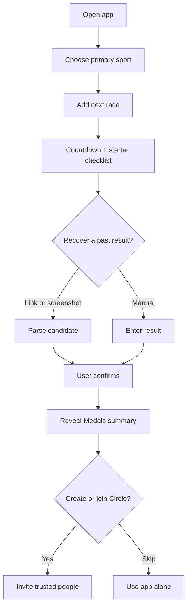
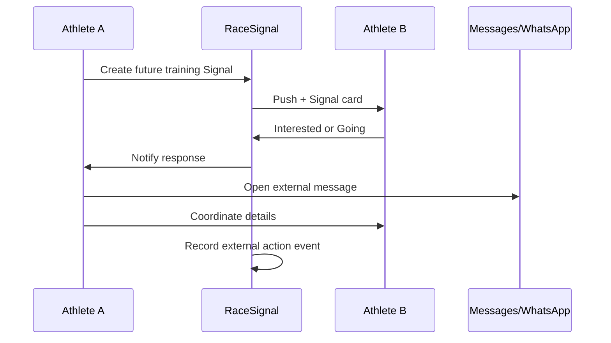
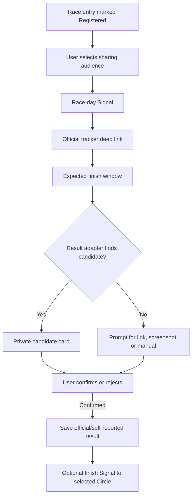
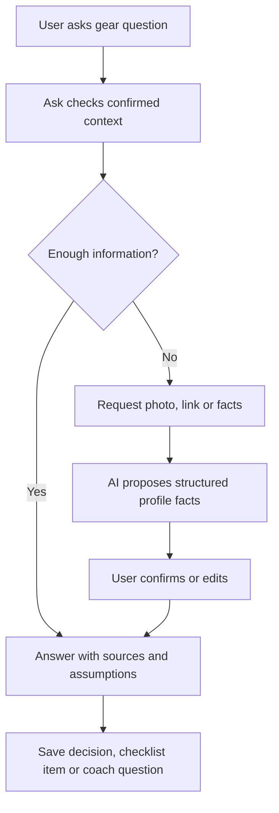

# RaceSignal V1 - Claude Code Single-File Build Package

**Prepared:** 2026-07-23  
**Purpose:** Upload or place this single Markdown file in the RaceSignal repository and give it to Claude Code as the complete product, UX, data, AI, monetization, analytics, QA, and launch specification.  
**Working product name:** RaceSignal: Triathlon  
**Brand guide:** intentionally deferred until the product structure is implemented and tested.

---

# CLAUDE CODE: READ THIS FIRST

You are the lead product engineer and product designer for RaceSignal. This file is the authoritative single-file package for V1.

## Operating contract

1. Read this entire file before proposing architecture or editing code.
2. Do not build the whole product in one pass. Implement one approved milestone at a time.
3. Before each milestone:
   - summarize the intended outcome in plain English;
   - list files you will create or modify;
   - identify assumptions and unresolved decisions;
   - state tests and acceptance criteria;
   - wait for approval if the change is broad, destructive, security-sensitive, or changes scope.
4. After each milestone:
   - run TypeScript checks, lint, tests, and Expo Doctor where applicable;
   - report every warning or failure;
   - explain exactly what a non-developer should test on an iPhone;
   - create a clean Git checkpoint;
   - stop for review.
5. Prefer the smallest compliant change. Never rewrite unrelated working code to fix a local problem.
6. GitHub is the source of truth. The project must remain portable outside any single AI or vibe-coding platform.
7. Use Expo React Native, TypeScript strict mode, Expo Router, Supabase, RevenueCat, and EAS unless an approved architecture decision changes that stack.
8. Never embed private API keys in the mobile application. Put secrets in server or EAS environments.
9. The app is iOS-first, but avoid unnecessary choices that make a later Android release impossible.
10. Do not widen V1 into Club Pro, coach dashboards, in-app chat, adaptive training, live GPS, public stranger discovery, or integrations with every timing provider.

## Authority and conflict order

When sections disagree, apply this order:

1. Locked V1 decisions in this opening section
2. Product Requirements Document
3. Canonical SQL schema, RLS, contracts, plans, and feature flags
4. UX Flows and Wireframes plus Visual Mockup Transcription
5. AI Architecture and Prompt Contract
6. Analytics and Experiment Plan
7. Implementation Roadmap and QA
8. Business case and ASO plan

Raise any unresolved conflict before coding.

## Locked V1 decisions

- Start with self-serve athlete value; add the private social loop only after the activation gate passes.
- Four tabs: Signal, Season, Medals, Ask.
- No Club Pro or coach-specific model in V1.
- Free athletes can import their entire history and see all event names, dates, and finish times; only the three latest detailed results are fully expanded.
- Free athletes can list unlimited future race intentions, but only one Race Mode is active at a time.
- Standard Signals are free and unlimited because they drive network growth.
- Premium Signal+ is intentionally simple in V1: templates, repeat-last, multiple audiences, custom title/note, and route link.
- Result recovery begins with official links, screenshots, and manual entry.
- The system uses provider adapters. AI performs parsing, normalization, and entity resolution; AI is never the source of truth.
- Every race-result candidate requires explicit athlete confirmation before saving or sharing.
- Athlete Profile is progressive. Ask requests missing bike, gear, nutrition, performance, or coach context at the moment it creates value.
- AI-proposed facts are unconfirmed until the athlete approves them.
- Premium includes 40 Ask credits per month, not 40 unrestricted expensive requests. Different workflows consume different credits.
- AI operating target: approximately $0.25-$0.50 per paid user per month, with explicit soft and hard alerts.
- Ask must create a durable outcome whenever appropriate: decision, checklist item, learning card, confirmed fact, coach question, performance note, or Signal draft.
- The app does not replace the athlete's coach, record GPS workouts, claim results automatically, or host in-app messaging.

## Recommended first Claude Code instruction

After reading this package, create an implementation plan for **Milestone A only**. Do not edit code until the plan is approved.

Milestone A should produce a polished mock-data app shell:

- Expo React Native with TypeScript and Expo Router;
- tabs: Signal, Season, Medals, Ask;
- profile/settings route;
- floating Send Signal action;
- next-race countdown card;
- current-year Season screen;
- Medals with expandable sample race cards;
- Ask landing screen without a live model;
- Send Signal composer using mock data;
- loading, empty, offline, and error states;
- accessible touch targets and labels;
- no Supabase, RevenueCat, AI backend, or social networking yet unless explicitly approved.

The purpose is to make the product tangible, test the information architecture on an actual iPhone, push it to GitHub, and prove an EAS/TestFlight build path early.

---

# Package manifest

This single file embeds the following source documents and implementation artifacts:

- `00_READ_ME_FIRST.md`
- `01_Product_Validation_and_Business_Case.md`
- `02_Product_Requirements_Document.md`
- `03_UX_Flows_and_Wireframes.md`
- `04_Data_Model_and_API.md`
- `05_AI_Architecture_and_Prompts.md`
- `06_Analytics_Experiment_Plan.md`
- `07_Implementation_Roadmap_and_QA.md`
- `08_Master_Vibecode_Prompt.md`
- `09_ASO_and_Launch_Plan.md`
- `database/schema.sql`
- `database/rls_social.sql`
- `database/seed.sql`
- `contracts/provider-adapter.ts`
- `contracts/ai-tools.ts`
- `analytics/events.json`
- `config/plans.json`
- `config/feature_flags.json`
- `suggested_project_tree.txt`
- `assets/mockups/interactive_prototype.html`
- Text transcription of the provisional nine-screen mockup overview

---

# Visual Mockup Transcription

This section converts the provisional mockup overview into a text-first specification that Claude Code can implement without needing a separate image file. Information hierarchy and interactions are authoritative; colors, typography, iconography, and final brand styling remain provisional.

## Shared visual structure

- iOS-first phone layout with a dark interface and light mint accent.
- Persistent bottom navigation: Signal, Season, Medals, Ask.
- Athlete avatar at the upper-right opens profile and settings.
- A mint floating `+ Signal` action appears on Signal, Season, Medals, and checklist surfaces where appropriate.
- Rounded cards, large numerical emphasis, restrained density, and high-contrast text.
- No infinite feed. Signal content is grouped by actionability and date.
- All key controls must support Dynamic Type, VoiceOver, 44x44 point touch targets, and reduced motion.

## Mockup 1 - Onboarding: add the next race

**Header:** `STEP 1 OF 3`

**Primary title:** `What are you training for?`

**Supporting copy:** Start with one race. The athlete will receive a countdown, checklist, and a place to recover previous finishes.

**Primary controls:**

1. Search field: `Search races, city or distance`
2. Suggested race card containing:
   - race name;
   - date and location;
   - distance badge;
   - tap to select.
3. Manual escape hatch:
   - heading: `Can't find it?`
   - copy: add the event manually in under a minute;
   - button: `Add race`.
4. Bottom CTA: `Continue with [selected race]`.

**Rules:** No paywall. Manual entry must work offline. Invalid or past dates show an inline correction rather than a dead end.

## Mockup 2 - Signal home

**Screen title:** `Signal`

**Top card - next race:**

- label: `YOUR NEXT RACE`;
- race name;
- large countdown, such as `41 days`;
- checklist completion percentage and progress bar;
- friend count badge;
- action: `Open race`.

**Priority card - response to my Signal:**

- label: `RESPONSE - NOW`;
- copy such as `James is interested in your 90 km ride`;
- time and intensity context;
- primary action: `Message James`;
- secondary action: `View Signal`.

**Date groups:** `Today`, `Saturday`, later dates.

**Signal cards may represent:**

- friend racing today with `Follow official tracker`;
- upcoming bike, run, swim, brick, strength, recovery, or race session;
- `Interested`, `Going`, `Add to calendar`, or external contact actions;
- recently confirmed result with `Congratulate`.

**Ordering:** responses to my Signals, live race-day moments, today, tomorrow/weekend, later sessions, recent results.

## Mockup 3 - Send Signal composer

**Title:** `Send a Signal`

**Supporting copy:** Tell the trusted Circle now, before the training opportunity passes.

**Sport chips:** Swim, Bike, Run, Brick, Strength, Recovery.

**Fields:**

- When
- Distance or duration
- Intensity
- Pace or speed
- Meeting point
- Target race
- Circle/audience

**Premium teaser:** saved Signal template or repeat-last option.

**Primary CTA:** publish/send after showing an audience preview.

**Speed requirement:** a common Signal should take fewer than ten seconds after defaults exist.

## Mockup 4 - Season

**Screen title:** `Season`

**Segmented control:** `My Season` and `Friends' Season`.

**Top next-race card:** countdown, checklist completion, registration status, and `Prepare` action.

**Filters:** All, Triathlon, Run, Bike, Swim, Other.

**Sections:**

- Upcoming
- Completed in the current year

Each compact race row contains date block, event name, location/status, and distance or sport badge.

**Free treatment:** current year is fully visible. Previous-year selectors remain visible but locked to Premium rather than disappearing.

## Mockup 5 - Medals

**Screen title:** `Medals`

**Top statistics:**

- total finishes;
- triathlons completed;
- personal record count;
- one highlighted best.

**Race history:** newest first, with filter control.

**Collapsed race card:**

- sport/distance label;
- race name;
- finish time;
- date and location;
- course-best or PR badge;
- compact split summary.

**Expanded race card:** full splits, rankings, conditions, equipment, source status, notes, and photos where available.

**Free treatment:** all event names, dates, and finish times remain visible; detailed older cards display a clear Premium lock.

## Mockup 6 - Recover a race

**Title:** `Recover a race`

**Supporting copy:** Begin with an official link or screenshot. The athlete confirms every result before it is saved.

**Tabs:** Link and Screenshot. Manual entry is always available as a fallback.

**Link flow:**

1. Paste official result URL.
2. `Find result`.
3. Show parse progress.
4. Present candidate with confidence, event, date, location, finish time, splits, and matching rationale.
5. Actions: `This is me`, `Not me`, `View official result`, and edit where needed.

**Trust rule:** AI ranks and normalizes. It does not claim the result or publish it.

## Mockup 7 - Race checklist

**Screen title:** `Race`

**Top card:** race name, `Race checklist`, completion percentage, and progress bar.

**Sections:** Planning, Pack - Swim, Pack - Bike, Pack - Run, Nutrition, Travel, and other event-relevant categories.

**Item interaction:** tap to complete. Free includes standard broad items. Premium adds custom items, reusable templates, due dates, gear-aware suggestions, and tested/untested status.

**Premium row:** `Add custom item` with an explanatory lock when unavailable.

## Mockup 8 - Ask with progressive athlete profile

**Title:** `Ask RaceSignal`

**Subcopy:** use the athlete's race, gear, and confirmed facts.

**Credit indicator:** visible but not dominant.

**Conversation example:** athlete asks whether race wheels or a power meter should be prioritized for an upcoming race.

**Progressive profile request:** when bike context is missing, Ask requests photos, a link, or manual details instead of requiring a full profile during onboarding.

**Proposed fact card:**

- AI proposes bike model, year, drivetrain, brakes, and wheels;
- athlete must `Confirm` or edit;
- only confirmed facts become durable profile context.

**Answer card:** direct recommendation, reasons, assumptions, and actions such as `Save decision` or `Ask coach`.

## Mockup 9 - Premium paywall

**Headline:** `Own your full season.`

**Value bullets:**

- all years of race history, splits, and advanced PRs;
- multiple active Race Modes and custom checklists;
- multiple Circles, templates, and repeat Signals;
- 40 Ask credits each month.

**Packages:**

- Annual: $59.99/year, 14-day trial, visually recommended;
- Monthly: $9.99/month, no trial.

**Primary CTA:** `Start annual trial`.

**Footer:** restore purchases, terms, and privacy.

**Context note:** explain why the paywall is being shown, such as unlocking a fourth detailed result, a custom checklist item, a second Circle, or more Ask credits.


---

# Embedded Source Document: `00_READ_ME_FIRST.md`

# RaceSignal V1 Build Package

**Working product name:** RaceSignal: Triathlon  
**Working subtitle:** Races, PRs & training friends  
**Status:** Validated enough to build a staged V1; not validated enough to scale paid acquisition  
**Brand system:** deliberately deferred

## Final product thesis

RaceSignal is a private endurance-season companion. It helps athletes:

1. add the race they are preparing for;
2. recover and organize their previous race results;
3. prepare with a practical race checklist;
4. ask questions using the context of their race, gear, results, coach notes, and confirmed profile facts;
5. create private, time-sensitive Signals so trusted friends can join future training before the opportunity passes.

The app does **not** record workouts, prescribe an adaptive training plan, replace the athlete's coach, host an infinite feed, or become a new messaging platform.

## Founder decision

**Build, but in stages.** The category has good subscription economics and an active, growing endurance audience. However, several products already cover individual pieces such as future race calendars, race archives, checklists, gear, and clubs. RaceSignal only has a credible wedge if it combines three loops:

- **Identity:** recover the athlete's race history and surface Medals, PRs, and next-race context.
- **Connection:** create actionable future training Signals inside trusted Circles.
- **Intelligence:** turn context-aware AI conversations into saved decisions, checklist tasks, profile facts, or Signal drafts.

The social layer is a growth and retention lever, not a requirement for day-zero value.

## Build order

### Stage 1 - Self-serve alpha

Build next race, countdown, checklist, result import, Medals, and three Ask workflows. Prove that one athlete receives value without inviting anyone.

### Stage 2 - Private social beta

Add one Circle, Standard Signals, Interested/Going responses, creator notifications, and external contact actions.

### Stage 3 - Public V1

Add Premium, Signal+, previous seasons, full historical detail, custom checklists, 40 monthly Ask credits, App Store metadata, and launch analytics.

Do not add Club Pro, coaching tools, in-app chat, live GPS, adaptive training, broad public discovery, or every result provider before these stages pass their gates.

## Recommended technical stack

- Expo React Native + TypeScript
- Expo Router
- Supabase Auth, Postgres, Row Level Security, Storage, and Edge Functions
- RevenueCat for entitlements and subscriptions
- OpenAI Responses API, called only from server-side functions
- Expo push notifications initially
- Product analytics with PostHog, Amplitude, or equivalent
- Sentry or equivalent for crashes and backend errors

This stack is selected for vibe-coding speed, iOS-first delivery, and a straightforward path to Android. Real in-app purchase testing requires a development build rather than relying only on Expo Go.

## Package map

- `01_Product_Validation_and_Business_Case.md` - market verdict, hypotheses, pricing, revenue model, risks, pivot gates
- `02_Product_Requirements_Document.md` - complete V1 scope and acceptance criteria
- `03_UX_Flows_and_Wireframes.md` - screen-by-screen behavior and mockup references
- `04_Data_Model_and_API.md` - entities, permissions, provider adapters, endpoints, and security
- `05_AI_Architecture_and_Prompts.md` - Ask design, credit economics, tools, safety, progressive profile
- `06_Analytics_Experiment_Plan.md` - event taxonomy, dashboards, target metrics, experiments
- `07_Implementation_Roadmap_and_QA.md` - staged build tickets, testing, App Store readiness
- `08_Master_Vibecode_Prompt.md` - self-contained prompt to give a coding agent or platform
- `09_ASO_and_Launch_Plan.md` - metadata, screenshot story, acquisition, and first-$1,000 plan
- `assets/mockups/interactive_prototype.html` - screen selector prototype
- `assets/mockups/*.png` - individual reference screens
- `database/schema.sql` - production-minded Supabase/Postgres schema
- `database/seed.sql` - realistic demo data
- `contracts/provider-adapter.ts` - result-provider contract
- `contracts/ai-tools.ts` - AI function/tool contracts
- `analytics/events.json` - canonical analytics taxonomy
- `config/plans.json` - Free/Premium limits and entitlements
- `config/feature_flags.json` - staged rollout controls

## How to use this package with a vibe-coding platform

1. Upload the entire ZIP, not just the master prompt.
2. Paste `08_Master_Vibecode_Prompt.md` into the platform's project instructions.
3. Tell the platform to treat `database/schema.sql` and the TypeScript contracts as canonical.
4. Give it the mockups as visual references, while stating that the brand system is provisional.
5. Ask it to implement Stage 1 only, run tests, and stop for review.
6. Do not let it silently expand scope or replace provenance/confirmation rules with AI guesses.
7. Add real Supabase, RevenueCat, OpenAI, analytics, and push credentials only through environment variables.

## Non-negotiable product rules

- Standard Signals are free and unlimited.
- Receiving and responding to Signals is always free.
- Every imported result requires user confirmation before becoming a claimed race result.
- AI is an entity-resolution and assistance layer, never the source of truth.
- AI may propose profile facts, but only confirmed facts enter the durable athlete profile.
- Ask must distinguish coach guidance, athlete data, general knowledge, and product inference.
- The app does not override or modify a coach's plan.
- Custom Signal text is user-generated content; reporting, blocking, filtering, and contact/support paths are required.
- The app must remain useful before the user invites a friend.

## Current recommendation in one sentence

**Build RaceSignal as a self-serve race record and preparation utility first, then prove that private future-training Signals produce real-world connections before expanding the social surface.**

---

# Embedded Source Document: `01_Product_Validation_and_Business_Case.md`

# Product Validation and Business Case

## 1. Executive verdict

**Decision: conditional GO.**

RaceSignal has a credible App Store opportunity because it sits in Health & Fitness, gives a single athlete immediate utility, supports an annual subscription, and has multiple organic invitation moments. It is not an empty market. The product must avoid the generic “all-in-one triathlon app” position and prove a specific sequence:

> Add the next race -> recover the racing history -> prepare intelligently -> invite trusted people into what happens next.

The strongest defensible wedge is not any one feature. It is the structured athlete context that connects race history, current race, gear, saved decisions, and private training intent.

## 2. Evidence supporting the build

### Category economics

RevenueCat's 2026 subscription benchmarks show that Health & Fitness is one of the strongest early-monetization categories:

- 2.9% median Day-35 download-to-paid conversion
- 37.7% median trial-to-paid conversion
- 68% of category revenue from annual plans
- $0.48 median Day-14 revenue per install and $0.66 at Day 60
- 82.1% of Health & Fitness trials begin on Day 0
- 57% median first monthly renewal and 25% median first annual renewal

These are category benchmarks, not a forecast. They support the market choice but also create a strict product requirement: the first session must produce a clear, personal payoff.

### Audience momentum

USA Triathlon reported 303,000 unique active members in 2025, with the 20-29 segment leading membership growth and 73% of participants choosing shorter formats. IRONMAN reported meaningful growth among younger and first-time athletes. The beachhead should therefore include first-time and progressing endurance athletes, not only experienced full-distance triathletes.

### Proven willingness to pay

Public pricing in the endurance category demonstrates substantial willingness to pay when an app improves planning, analysis, coaching, or race execution:

| Product | Monthly | Annual | Core value |
|---|---:|---:|---|
| Strava | approximately $11.99 | approximately $79.99 | activity network, routes, analysis |
| TrainingPeaks Premium | $19.95 | $134.99 | training planning and analysis |
| MOTTIV Premium | $19.99 | $179.99 | endurance training plans |
| Best Bike Split | $19 | $119 | cycling race pacing |
| MyVeloFit Pro | - | $75 | AI-assisted bike fit |

RaceSignal should remain below specialist training platforms because it does not replace them, but it can price above a narrow utility if Ask and historical depth become meaningfully personalized.

## 3. Competitive pressure test

### Direct and adjacent products

| Product | What it validates | Where RaceSignal must separate |
|---|---|---|
| Eiko | athletes want to see friends' future races | Eiko is free and centered on a shared race calendar; RaceSignal adds history recovery, preparation, Ask, and training intent |
| T-Zero | demand exists for race checklists, gear, results, and community | a broad feature bundle alone has not produced visible breakout traction; RaceSignal needs one coherent loop |
| Finisher Wall | athletes want a digital medal archive and shareable results | RaceSignal must connect the archive to upcoming races, private Circles, and contextual decisions |
| Your-Run | race calendars, archives, best lists, and social race presence are established jobs | RaceSignal should not compete on database breadth alone |
| Konia | clubs need training-session and race coordination | club administration is deliberately postponed; private athlete Circles are lighter-weight |
| Strava | completed activities and athletic identity are powerful | RaceSignal owns future intent and race context rather than recording completed training |
| TrainingPeaks | athletes and coaches pay for structured plans and analysis | RaceSignal complements the plan and explains surrounding decisions; it does not prescribe training |
| Athlinks / Sportstats / official timers | race data has high identity value | RaceSignal should preserve source provenance, use adapters, and never pretend to be the timing authority |

### Competitive conclusion

There is no evidence that users need another generic race calendar or another archive alone. The build earns its chance only through the combined experience:

1. immediate next-race setup;
2. low-friction result recovery;
3. a persistent and useful racing identity;
4. action-oriented private Signals;
5. an AI layer that becomes better as confirmed context accumulates.

## 4. Founder scorecard

These are strategic judgments rather than measured market statistics.

| Dimension | Score | Rationale |
|---|---:|---|
| Pain and emotional relevance | 8/10 | races are expensive, identity-forming, deadline-driven events |
| Day-zero utility | 8/10 | next race, checklist, result recovery, and Ask can work alone |
| App Store discoverability | 7/10 | clear triathlon/race/PR/checklist keywords, but a niche audience |
| Willingness to pay | 7.5/10 | category and competitor prices support $59.99 annual if value is deep |
| Organic growth | 7/10 | race cards, Circles, result cards, and Signals create invitations |
| Retention potential | 7/10 | seasonality is a risk; history and Ask must bridge between races |
| Technical feasibility | 8/10 | V1 can ship without live GPS or deep provider partnerships |
| Data integration risk | 5.5/10 | result sources are fragmented and permissions vary |
| Competitive defensibility | 6.5/10 today | must compound athlete context, confirmations, and relationship graph |
| Overall | 7.6/10 | worth a staged build, not a blind full-scope launch |

## 5. Core hypotheses

### H1 - next-race activation

Athletes with an upcoming event will add it during the first session because the countdown and checklist are immediately useful.

- Target: at least 65% of qualified new users add a next race.
- Failure signal: below 45% after onboarding has been tested with 200 qualified athletes.

### H2 - race-history identity

Seeing past results and PRs in one place creates an emotional payoff worth returning for.

- Target: 40% confirm at least one past result within seven days.
- Target: 20% import or manually add at least three results.
- Failure signal: fewer than 25% confirm any result after the import flow is simplified.

### H3 - preparation utility

A broad, prebuilt checklist creates repeated pre-race value; custom and reusable checklists are a reasonable premium boundary.

- Target: 30% complete at least three checklist items in week one.
- Target: 20% return to the checklist in a second week.

### H4 - contextual Ask

Athletes will pay for AI when it uses their race, confirmed gear, coach notes, and history rather than returning generic answers.

- Target: 25% of activated users start one Ask session.
- Target: 35% of Ask sessions save an artifact, profile fact, checklist item, or Signal draft.
- Target: 40% of Ask users ask a second question within 14 days.
- Failure signal: artifact-save rate below 20% or repeat Ask below 25%.

### H5 - private connection loop

A future Signal inside an existing trusted group can produce a meaningful off-app action.

- Target: 30% of activated users create or join a Circle.
- Target: 20% of viewed Signals receive Interested or Going.
- Target: 40% of positive responses lead to an external message, calendar action, or confirmed training session.
- Target: 20% of Circles with at least three members send another Signal in week two.

### H6 - paid demand

Historical depth, multiple Race Modes, custom checklists, Signal+, and Ask can support a $59.99 annual subscription.

- Target: 2.0% or better Day-35 download-to-paid during early targeted launch.
- Stretch: match the 2.9% Health & Fitness category median.
- Target: annual plans represent more than 60% of paid starts.
- Target: 35-40% trial-to-paid once the annual trial has meaningful volume.

## 6. Product strategy: self-serve first, social second

The product should be built and measured in two layers.

### Self-serve foundation

- Add next race
- Countdown
- Standard checklist
- Recover result from link, screenshot, or manual entry
- Medals and latest-three detailed results
- Ask workflows

This layer must activate and retain one athlete without relying on network density.

### Social leverage

- Create one Circle
- Invite existing friends
- Send a future Signal
- Respond Interested or Going
- Notify the creator
- Open Messages, WhatsApp, or Calendar

The app does not need to own the conversation. Its job is to create the reason and timing for the connection.

## 7. Monetization recommendation

### Free

- Join unlimited Circles; create one
- Unlimited Standard Signals
- Receive and respond to every Signal
- Unlimited future race intentions
- One active Race Mode
- Current calendar-year Season
- Import full race history
- Lifetime summary and all race names/dates/times
- Full detail for latest three results
- Standard checklist
- Three Ask credits per month

### Premium

**Recommended launch prices:**

- $9.99 monthly, no trial
- $59.99 annually, 14-day trial

The monthly price can be tested against $7.99 after the paywall has at least 500 qualified views. Keep both products in one subscription group.

Premium unlocks:

- Multiple Circles
- Signal+ templates, repeat-last, multiple audiences, custom title/note, and route link
- Multiple active Race Modes
- Previous seasons
- All race details, advanced splits, PRs, and comparisons
- Custom and reusable checklists
- Photos and race notes
- 40 Ask credits monthly
- Progressive confirmed athlete and equipment memory

### Why this packaging

Network actions remain free because every restriction on creating, receiving, or responding to Standard Signals reduces growth. Premium is based on depth, memory, analysis, and repeated preparation rather than social reach.

## 8. Illustrative first-$1,000 model

Assumptions:

- 1,000 highly qualified downloads
- 2.9% Day-35 download-to-paid conversion
- 29 paid users
- 70% annual and 30% monthly purchase mix
- weighted initial gross revenue per paid user: $44.99

Illustrative outcome:

- gross revenue: approximately $1,305
- proceeds after a 15% store commission: approximately $1,109 before taxes, refunds, infrastructure, and other costs

This is a benchmark scenario, not a forecast. At 800 downloads, the same assumptions produce about $1,044 gross but less than $1,000 after the store fee. The operating goal should therefore be **1,000 targeted downloads**, not merely $1,000 gross bookings.

## 9. AI unit economics

Forty credits are viable if credits map to cost and the backend routes models deliberately.

Suggested credit schedule:

| Workflow | Credits |
|---|---:|
| workout explanation or basic preparation question | 1 |
| photo/screenshot analysis | 2 |
| gear comparison using supplied links | 2 |
| current product research with live web search | 3 |
| deeper race or activity comparison | 3 |

At current public model pricing, a normal well-bounded text question can cost only a fraction of one cent. A mixed month of 40 credits should be budgeted at $0.25-$0.50 per paid user, with a $0.50 soft alert and $1.00 hard operational limit. Result imports do not consume Ask credits.

## 10. Growth model

### Organic loops

1. **Race invitation:** “I am doing Muskoka. Are you?”
2. **Training Signal:** a friend receives a relevant future session, responds, and joins the Circle.
3. **Result card:** the athlete shares a confirmed finish or PR from Medals.
4. **History recovery:** a user sees another athlete's Medals card and imports their own history.
5. **Ask artifact:** a useful gear decision or race checklist is saved and optionally shared without exposing the private conversation.

### Acquisition channels

- local triathlon clubs and group chats
- race-specific Facebook groups, Reddit communities, Discords, and newsletters
- triathlon coaches and creators as referral partners, without building a coach product yet
- race-specific SEO pages and checklists
- build-in-public posts demonstrating recovered histories and real training connections
- referrals after a result is confirmed or a Signal receives a response

## 11. Go, no-go, and pivot rules

### Proceed to private social beta only if

- at least 45% of qualified alpha users complete next-race setup plus one meaningful action;
- at least 25% confirm a past result;
- week-two retained activation is at least 20%.

### Keep Signals core only if

- at least 20% of Circles with three or more members repeat the behavior in week two;
- at least 20% of viewed Signals receive a response;
- positive responses frequently produce an external action.

### Keep Ask prominent only if

- at least 35% of Ask sessions save an artifact or profile fact;
- at least 25% of Ask users return for a second Ask;
- AI cost stays below the operational budget.

### Repackage Premium if

- Day-35 paid conversion stays below 1.5% after 1,000 targeted downloads and at least two onboarding/paywall iterations;
- annual trial-to-paid stays materially below 25%;
- paid users do not use at least two distinct premium value pillars.

### Pivot path

If history recovery, Medals, preparation, and Ask retain but Signals do not, narrow the company to:

> A private race record and contextual preparation app for endurance athletes.

The database, provider adapters, AI memory, paywall, ASO foundation, and core screens remain useful. Do not force a social network merely because it was part of the original concept.

## 12. Final validation conclusion

RaceSignal has a credible chance to grow and monetize, but only if the product remains disciplined:

- the first session must produce value before an invite;
- provider provenance and confirmation must be trustworthy;
- AI must create durable outcomes, not chat volume;
- Standard Signals must remain free;
- the launch must target athletes with a race on the calendar, not broad fitness traffic;
- social behavior is validated experimentally, not assumed.

---

# Embedded Source Document: `02_Product_Requirements_Document.md`

# RaceSignal V1 Product Requirements Document

## 1. Product definition

RaceSignal is an iOS-first private endurance-season app for triathletes, runners, cyclists, swimmers, and multi-sport athletes. It combines the athlete's upcoming races, confirmed historical results, race preparation, contextual Ask assistance, and private future-training Signals.

### Product promise

> Know what you are racing, remember what you have accomplished, and see what your people are doing next.

### Positioning boundary

RaceSignal does not:

- record GPS workouts;
- create adaptive training plans;
- replace a coach;
- replace Strava, TrainingPeaks, WhatsApp, or official timing systems;
- provide public stranger matching in V1;
- publish inferred race results or personal data without confirmation.

## 2. Primary users

### Persona A - progressing triathlete

- has a coach or a plan elsewhere;
- races one to four times per year;
- uses Strava, a watch, and group chats;
- wants better context around gear, execution, and preparation;
- values race history and personal identity.

### Persona B - first-time 70.3 athlete

- has a clear deadline and high anxiety;
- needs a practical checklist and explanations;
- has fragmented race and training information;
- is willing to pay to avoid preventable race-day mistakes.

### Persona C - social endurance athlete

- trains with a club or trusted group;
- repeatedly coordinates sessions in WhatsApp or text;
- wants to know who is swimming, biking, or running before it happens;
- does not need another chat app.

## 3. Jobs to be done

1. When I commit to a race, help me see the countdown and what I need to do next.
2. When my results are spread across timing providers, help me recover and confirm my racing record.
3. When I want to train with people I already trust, help me signal the opportunity before it passes.
4. When a friend responds, notify me and make it easy to contact them elsewhere.
5. When I have a gear, nutrition, performance, or workout question, use my actual context and save the useful outcome.
6. When race day arrives, help my Circle notice and celebrate the moment without publishing unconfirmed data.

## 4. Information architecture

### Bottom tabs

1. **Signal** - next race plus the most actionable private Signals
2. **Season** - current-year races for the athlete and friends
3. **Medals** - lifetime racing identity and result archive
4. **Ask** - contextual assistance and saved decisions

### Global controls

- floating Send Signal action on Signal, Season, and Medals
- athlete avatar opens Profile, Connections, Privacy, Subscription, Support, Blocked Users, and Settings
- universal notification center is not required in V1; attention items appear at the top of Signal

## 5. Onboarding

### Goal

Create value in under three minutes without requiring an invite or a full athlete profile.

### Required sequence

1. Welcome/value proposition
2. Sign in with Apple or continue to preview; require authentication before persistence
3. Choose primary sport(s)
4. Add next race through search or manual entry
5. Show countdown and starter checklist immediately
6. Offer to recover one past result by link, screenshot, or manual entry
7. Reveal Medals summary
8. Ask whether the athlete wants to create/join a Circle; this is skippable
9. Do not show the paywall before the user has seen a personal result, checklist, or Ask preview

### Minimal onboarding data

- display name
- primary sport(s)
- unit preference
- next race name/date/location/distance
- optional avatar and location

Do not ask for height, weight, bike, shoes, devices, nutrition, zones, or extensive health information during onboarding.

## 6. Signal tab

### Top race card

Display:

- race name
- distance/type
- days remaining
- checklist completion
- number of friends registered/considering, if any
- tap target to open Race Mode

If no next race exists, display a single, prominent Add next race action.

### Signal ordering

Order by actionability and event time:

1. responses to the current user's Signals;
2. race-day/live moments;
3. sessions happening today;
4. tomorrow;
5. this weekend;
6. later;
7. confirmed recent results, no older than 48 hours.

### Standard Signal fields

- type: swim, bike, run, brick, strength, recovery, race
- scheduled start time
- optional distance or duration
- optional intensity
- optional pace/speed range
- optional approximate meeting point
- optional associated race
- one Circle for Free
- optional structured preset note selected from approved choices
- expiration time, defaulting shortly after scheduled start

### Signal responses

- Interested
- Going
- Cannot join

On Interested or Going:

- notify the creator;
- show the response at the top of the creator's Signal tab;
- offer Messages, WhatsApp, copy details, and add-to-calendar actions;
- do not automatically expose phone numbers unless both users have separately enabled contact sharing.

### Signal+ Premium fields

V1 includes only:

- saved templates;
- repeat last Signal;
- multiple Circle audiences;
- custom title and note;
- route URL;
- template management.

No weather, automatic creation, recurring schedules, capacity, waitlists, or pace matching in the first release.

### Race-day Signal

If the athlete has enabled race-day sharing for a Circle:

- generate a Signal when the local race date begins or at a user-confirmed start time;
- display race, location, approximate start, and official tracker link if available;
- label live timing as official-link data, not RaceSignal-verified;
- never expose exact location unless the athlete explicitly shares it.

### Finish Signal

- after the expected finish window, prompt the athlete to add or confirm a result;
- if an adapter yields a candidate, show it privately;
- only after confirmation create the result and optional finish Signal;
- allow the athlete to edit the audience or decline sharing.

## 7. Season tab

### My Season

- current calendar year by default
- filters: All, Triathlon, Running, Cycling, Swimming, Duathlon, Other
- sections: Upcoming, Completed, DNS/DNF if present
- race statuses: Considering, Registered, Racing today, Completed, DNS, DNF
- unlimited future race intentions on both plans
- one active Race Mode on Free; multiple on Premium

### Friends' Season

- show only races shared by accepted Circle members
- organize by race/event, not alphabetically by athlete
- show count and accepted members
- allow the current user to add or mark interest in the same race
- respect per-race visibility

### Previous seasons

- Premium can select prior calendar years
- Free sees current year only in Season, while Medals still displays all race names/dates/times

## 8. Race Mode and checklist

### Race page

- race identity and date
- countdown
- user status and goal time
- friends attending
- checklist progress
- training Signals connected to the race
- result section after race day

### Standard checklist - Free

Include broad planning and packing items:

- registration confirmation
- travel and hotel
- bike service
- race documents
- wetsuit, goggles, backup goggles, anti-chafing
- bike, helmet, shoes, bottles, repair kit, electronics and batteries
- running shoes, socks, hat, sunglasses, race belt
- breakfast, bike fuel, run fuel, electrolytes, backup nutrition

### Premium checklist

- add/edit/delete custom items
- save reusable templates
- assign due dates
- mark Tested / Untested
- create items from Ask
- suggest items from confirmed Gear Locker facts
- duplicate a previous race checklist

## 9. Medals tab

### Summary

- total confirmed finishes
- finishes by discipline
- distance bests
- course bests
- recent PR count
- current-year highlights

### Race cards

Always display:

- event name
- date
- location
- sport/distance
- finish time
- source label
- confirmation status

Expanded details may include:

- swim, T1, bike, T2, run and other provider splits
- pace, speed, power, cadence when explicitly available
- overall, gender, and age-group placement
- conditions
- equipment used
- source URL
- photos
- notes and lessons

### Free boundary

- import unlimited results
- show all confirmed event names, dates, and finish times
- lifetime summary
- expand the three most recent confirmed results
- older detail is visibly locked but not hidden

### Premium boundary

- expand every race
- advanced PRs and split comparisons
- course bests
- year trends
- photos and notes
- equipment history
- Ask comparisons and exports

### PR rules

- distinguish distance best from course best;
- never imply that all courses are directly comparable;
- preserve event distance, elevation, conditions, and source;
- let users hide a suspicious or shortened course from PR calculations.

## 10. Result recovery

### V1 input modes

1. paste official result link;
2. upload screenshot;
3. manual entry.

### Required states

- input received
- provider detected or generic
- parsing
- candidate(s) found
- no candidate; offer manual entry
- user confirmation
- confirmed
- rejected
- corrected by user

### Confirmation card

Show:

- provider/source
- event, date, distance, location
- finish time and extracted splits
- confidence level
- reasons for the match
- This is me / Not me / Edit / View official source

### Trust rules

- AI never auto-claims;
- missing splits remain null, never invented;
- corrections are stored separately from the original payload;
- provenance stays attached;
- a race result is not shared until confirmed;
- broad crawling or scraping requires provider permission.

## 11. Ask tab

### Product role

Ask complements the athlete's coach. It explains, compares, prepares, and converts conversations into persistent product objects.

### Launch workflows

1. explain a coach-prescribed workout;
2. make a gear decision using uploaded facts or links;
3. prepare for a race and create checklist items;
4. interpret a simple performance comparison when the user supplies data;
5. create a Signal draft from a conversation.

### Progressive profile

When relevant data is missing, Ask requests it in context. Examples:

- bike photo/model before a wheel or power-meter answer;
- current shoes and race distance before shoe advice;
- race start and tested foods before carb-loading guidance;
- zones or coach notes before explaining an interval workout.

AI may propose profile facts. The user must confirm or edit them before they enter the durable profile.

### Saved artifacts

- Gear Decision
- Learning Card
- Preparation Plan
- Checklist Items
- Performance Note
- Coach Question
- Signal Draft

### Credits

- Free: 3 credits/month
- Premium: 40 credits/month
- clarification messages and failed tool calls do not consume extra credits
- link/screenshot result import does not consume Ask credits

## 12. Profile and settings

### Progressive profile sections

- athlete basics and units
- name aliases for result matching
- body/fit facts, optional
- bike and components
- swim, cycling, and running gear
- devices and connected services
- performance zones
- tested nutrition and dietary restrictions
- coach notes
- budgets and priorities

Each fact stores source, confidence, visibility, and confirmation state.

### Privacy controls

- Circle visibility by data type
- race-day sharing per race
- result sharing after confirmation
- Signal audience
- exact location off by default
- AI data-consent explanation
- delete account and export data
- blocked users

## 13. Subscription and paywall

### Products

- `racesignal_premium_monthly` - $9.99/month
- `racesignal_premium_annual` - $59.99/year, 14-day introductory trial

### Paywall triggers

Use contextual triggers rather than a forced first-launch wall:

- user attempts to expand the fourth detailed result;
- user creates a second active Race Mode;
- user adds a custom checklist item;
- user creates a second Circle;
- user uses all free Ask credits;
- user attempts a Signal+ feature.

### Paywall requirements

- state the exact locked value;
- show monthly and annual plans;
- annual selected by default;
- restore purchases;
- terms and privacy links;
- accurate trial disclosure;
- no deceptive countdowns or unverifiable claims.

## 14. Notifications

Required notification types:

- Circle invitation
- new Signal in a Circle
- response to my Signal
- race-day Signal
- result candidate found
- finish confirmed by friend
- checklist due reminder
- trial and subscription lifecycle messaging handled appropriately

Users can configure categories. Do not require push permissions to use the app.

## 15. Safety, moderation, and compliance

Because custom Signal titles/notes are user-generated content, V1 must include:

- filtering of clearly objectionable custom text;
- report Signal/user;
- block user;
- support/contact information;
- admin review workflow and timely response process;
- terms, community standards, and privacy policy;
- remove or redact content after a valid report.

The app should use structured fields wherever possible to reduce moderation risk.

## 16. Non-functional requirements

- iOS-first; architecture remains Android-compatible
- accessible labels and dynamic type where practical
- all critical flows usable with one hand
- core screens load from cache when temporarily offline
- server-side secret management
- Row Level Security on every private table
- result and AI processing idempotent
- audit log for result confirmation and sensitive visibility changes
- crash-free session target above 99.5% during beta
- p95 API latency below 1.5 seconds for ordinary reads/writes, excluding AI/provider processing

## 17. V1 definition of done

V1 is complete only when a new user can:

1. authenticate;
2. add a next race;
3. see a countdown and starter checklist;
4. import or manually add a past result and confirm it;
5. view Medals and current Season;
6. create a Circle and invite a friend;
7. send a Standard Signal;
8. receive an Interested/Going response notification;
9. open an external contact action;
10. ask a context-aware question and confirm a proposed profile fact;
11. encounter and complete a RevenueCat purchase;
12. restore that purchase;
13. report or block a user;
14. delete their account and personal data.

---

# Embedded Source Document: `03_UX_Flows_and_Wireframes.md`

# UX Flows and Wireframes

The visual system in `assets/mockups` is provisional. Treat information hierarchy, copy, states, and interaction rules as canonical; brand colors, logo, illustration style, and final typography will be developed later.

## Mockup index

| Screen | File | Purpose |
|---|---|---|
| Onboarding next race | `assets/mockups/01_onboarding_next_race.png` | creates immediate personal context |
| Signal home | `assets/mockups/02_signal_home.png` | next race plus actionable private Signals |
| Send Signal | `assets/mockups/03_send_signal.png` | low-friction future training intent |
| Season | `assets/mockups/04_season.png` | current-year racing calendar |
| Medals | `assets/mockups/05_medals.png` | lifetime race identity |
| Result recovery | `assets/mockups/06_result_import.png` | provenance-first candidate confirmation |
| Race checklist | `assets/mockups/07_race_checklist.png` | repeated preparation utility |
| Ask/profile | `assets/mockups/08_ask_progressive_profile.png` | contextual AI and progressive memory |
| Paywall | `assets/mockups/09_paywall.png` | contextual annual-first conversion |

Open `assets/mockups/interactive_prototype.html` to switch between the screens.

## Flow A - first-session value



### UX rule

The user sees an outcome before being asked to subscribe or complete a detailed profile.

## Flow B - send and act on a Signal



### UX rule

A Signal is successful when it causes a response and external contact, not when it merely receives views.

## Flow C - race-day and finish result



### UX rule

No candidate is publicly associated with the athlete before confirmation.

## Flow D - progressive Ask profile



### UX rule

The profile grows because the user is receiving value, not because the app demands a long form.

## Detailed screen specifications

## 1. Onboarding: add next race

### Primary action

Search or manually add an upcoming race.

### Required UI

- sport-aware search placeholder;
- suggested/local races when available;
- manual add escape hatch;
- clear statement of the immediate benefit;
- continue action;
- no subscription wall.

### Empty/error states

- no search result;
- duplicate race entry;
- date in the past;
- invalid/manual date;
- offline: permit manual entry and sync later.

## 2. Signal home

### Required hierarchy

1. next race card;
2. response to my Signal;
3. live race day;
4. today's sessions;
5. future sessions;
6. recent confirmed result.

### Empty state

If no Circle or Signals exist:

- keep the next-race card;
- show one starter card: “Invite the people you already train with”;
- offer “Send a Signal” with a personal-only preview before inviting anyone;
- do not show a blank feed.

### Crowded state

- display at most five items on first view;
- group by date;
- collapse later items behind “See later Signals”;
- rank responses and compatible race context above generic activity.

## 3. Send Signal

### Interaction target

A common Signal should take fewer than ten seconds after defaults exist.

### Defaults

- last-used Circle;
- current target race;
- unit system;
- common meeting point;
- previous pace/speed range by sport;
- expiration shortly after start time.

### Validation

- scheduled time cannot be far in the past;
- distance and duration are optional but must be positive;
- custom notes are filtered;
- exact private-address sharing requires an explicit warning;
- audience preview appears before publish.

## 4. Season

### My Season

Current-year races organized by Upcoming and Completed. Race filters remain sticky during the session.

### Friends' Season

Events are primary; friends appear under events. A user can mark themselves Considering or Registered for the same event.

### Free/Premium treatment

Do not make previous years disappear. Show the year selector with locked prior years and explain the benefit before paywall.

## 5. Medals

### Top statistics

Avoid a vanity dashboard with too many metrics. Launch with:

- total finishes;
- total triathlons;
- current PR count;
- one highlighted distance/course best.

### Result cards

Collapsed cards show identity. Expanded cards show detail. Locked old details remain visually discoverable.

### Trust presentation

Display source status:

- Official source confirmed
- Imported and confirmed
- Self-reported
- Candidate, not yet confirmed

## 6. Result recovery

### Link route

- paste link;
- detect provider;
- show parse progress;
- present one or more candidates;
- user confirms.

### Screenshot route

- upload or take photo;
- crop if needed;
- OCR/extraction;
- show parsed fields with confidence;
- require confirmation.

### Manual route

- event name, date, sport/distance, finish time;
- optional splits;
- optional source link;
- mark self-reported.

### No-result state

Do not dead-end. Offer:

- edit athlete matching facts;
- upload a screenshot;
- manual entry;
- open the provider's official search page.

## 7. Checklist

### Interaction

- tap to complete;
- section progress;
- optional due dates for Premium;
- no gamified penalties;
- Ask may propose items, but user chooses whether to add.

### Race-complete state

After result confirmation, prompt to archive checklist and optionally reuse lessons for the next race.

## 8. Ask

### Entry suggestions

- Explain a workout
- Compare gear
- Prepare for my race
- Review a performance question
- Create a training Signal

### Response anatomy

1. direct answer;
2. context used;
3. missing information or assumptions;
4. coach/data/general/inference labels where relevant;
5. one or two actions;
6. sources for current product or medical/nutrition claims.

### Long conversation handling

- summarize completed turns;
- keep durable facts separately;
- let the user start a new topic;
- do not make conversation history the only storage for decisions.

## 9. Paywall

### Contextual headline examples

- Fourth result: “Unlock your full race history.”
- Custom checklist: “Build the checklist you reuse every race.”
- Second Circle: “Separate your triathlon, cycling, and running people.”
- Ask limit: “Keep RaceSignal personalized to your season and gear.”

### Paywall test variants

A. Identity: “Own your full season.”  
B. Preparation: “Arrive ready for every start line.”  
C. Intelligence: “Answers that know your race and gear.”

The default package should lead with identity and preparation; AI supports the value rather than becoming the entire promise.

## Accessibility and usability

- minimum 44x44 touch targets;
- meaningful VoiceOver labels;
- high contrast;
- dynamic type without truncating critical data;
- do not rely on color alone for status;
- use icons plus text for sport and response state;
- support reduced motion;
- avoid dense tables on mobile; use expandable cards.

---

# Embedded Source Document: `04_Data_Model_and_API.md`

# Data Model and API Design

`database/schema.sql` is the canonical schema. This document explains the domain model and the behavior expected from the API layer.

## 1. Domain boundaries

### Identity and profile

- `profiles`
- `athlete_facts`
- `profile_aliases`
- `device_connections`

### Racing

- `races`
- `race_entries`
- `result_sources`
- `race_results`
- `result_splits`
- `race_media`

### Preparation

- `checklist_templates`
- `checklist_template_items`
- `race_checklist_items`

### Social

- `circles`
- `circle_members`
- `circle_invites`
- `signals`
- `signal_audiences`
- `signal_responses`
- `user_blocks`
- `content_reports`

### Intelligence

- `ai_threads`
- `ai_messages`
- `ai_artifacts`
- `ai_usage_ledger`

### Monetization and operations

- `entitlements_cache`
- `device_tokens`
- `notification_preferences`
- `audit_events`

## 2. Key modeling decisions

### Race versus race entry versus result

- A **race** is the canonical event: event name, date, place, sport, distance, official source.
- A **race entry** is the athlete's relationship to the event: considering, registered, completed, goal, visibility, Race Mode.
- A **race result** is a candidate or confirmed performance tied to an athlete and race.

This separation supports multiple athletes at the same event, changing race status, and results from multiple providers.

### Result provenance

Every result stores:

- source provider;
- source URL and provider IDs where available;
- raw extracted payload;
- normalized fields;
- match confidence;
- candidate/confirmed/rejected status;
- confirmation actor and timestamp;
- original values and manual corrections.

### Athlete facts

The profile is an extensible fact store rather than one giant nullable table. Each fact includes:

- category and key;
- JSON value;
- source type;
- confidence;
- confirmation state;
- visibility;
- effective date;
- optional superseded fact.

Examples:

- `bike.model = Cervelo P-Series`
- `performance.ftp_watts = 265`
- `nutrition.dietary_restrictions = [vegetarian]`
- `coach.cadence_guidance = stay above 85 rpm on climbs`

Only confirmed facts are automatically used in high-impact Ask answers.

### Signal audiences

A Signal has one or more `signal_audiences`. Free users may target one Circle; Premium users may target multiple. The data model supports both without duplicating the Signal.

## 3. Provider adapter architecture

The TypeScript contract in `contracts/provider-adapter.ts` is canonical.

### V1 adapters

- Generic URL adapter
- Generic screenshot adapter
- Manual adapter
- provider-specific parser only where terms and permissions permit

### Adapter lifecycle

1. `canHandle(input)`
2. `extract(input)` returns raw candidates
3. `normalize(raw)` returns a normalized candidate
4. entity resolution scores candidate against confirmed athlete context
5. user confirms, rejects, or edits
6. canonical result is created

### Adapter constraints

- adapters are deterministic where possible;
- AI parsing output must conform to a strict schema;
- low-confidence extraction is surfaced as incomplete;
- no broad scraping without written permission;
- external errors never destroy the original user input;
- adapter calls are idempotent.

## 4. Entity resolution

### Candidate factors

- normalized name similarity;
- known aliases;
- event and date;
- age group or birth year;
- city/country;
- distance and discipline;
- bib number;
- official source identity;
- activity on the same date;
- approximate finish window.

### Suggested confidence bands

- 90-100: high-confidence candidate; still requires user confirmation
- 70-89: possible match; show reasons prominently
- below 70: do not surface by default unless the user asks to broaden search

### Important rule

Confidence is a ranking aid, not permission to claim or publish.

## 5. API surface

All sensitive mutations run through authenticated server functions or Postgres RPCs with RLS.

### Race and result endpoints

- `POST /races/search`
- `POST /race-entries`
- `PATCH /race-entries/:id`
- `POST /result-imports`
- `GET /result-imports/:id`
- `POST /result-candidates/:id/confirm`
- `POST /result-candidates/:id/reject`
- `PATCH /race-results/:id`
- `GET /users/:id/medals`

### Circle and Signal endpoints

- `POST /circles`
- `POST /circles/:id/invites`
- `POST /circle-invites/:token/accept`
- `DELETE /circles/:id/members/:userId`
- `POST /signals`
- `GET /signals/feed`
- `POST /signals/:id/responses`
- `POST /signals/:id/external-action`
- `POST /users/:id/block`
- `POST /reports`

### Checklist endpoints

- `GET /race-entries/:id/checklist`
- `PATCH /race-checklist-items/:id`
- `POST /race-entries/:id/checklist-items`
- `POST /checklist-templates`
- `POST /race-entries/:id/apply-template`

### Ask endpoints

- `POST /ai/threads`
- `POST /ai/threads/:id/messages`
- `POST /ai/profile-facts/:id/confirm`
- `POST /ai/artifacts/:id/save`
- `GET /ai/usage`

## 6. Row Level Security model

### Profiles

- public fields visible only to accepted Circle members when the user enables that visibility;
- private athlete facts visible only to owner and server-side AI service role;
- no client can query another user's private facts.

### Circles

- Circle metadata visible to accepted members;
- owner can manage membership;
- members can leave;
- invite tokens are hashed and expire.

### Signals

- visible only to creator and users in active target audiences;
- expired Signals may remain in the creator's history but disappear from other members' active feed;
- blocked relationships remove visibility in both directions.

### Results

- owner always has access;
- shared summary follows race-entry visibility;
- detailed splits follow result-detail visibility;
- candidate results are owner-only.

### AI

- messages and artifacts are owner-only;
- private Ask conversations are never shared with Circle members;
- backend service accesses only the context required for the current request.

## 7. Storage design

Buckets:

- `avatars`
- `result-imports-private`
- `race-media-private`
- `gear-photos-private`
- `share-cards-public` for explicitly generated public cards only

Use signed URLs for private assets. Strip image metadata where possible. Establish retention rules for rejected result screenshots and unused gear uploads.

## 8. Idempotency and background jobs

Background tasks:

- result parsing and entity resolution;
- notification fan-out;
- Signal expiration;
- race-day and expected-finish prompts;
- checklist reminders;
- RevenueCat webhook reconciliation;
- AI usage aggregation;
- deletion/export jobs.

Each job must use an idempotency key and write an audit event.

## 9. Suggested server functions

- `import-result`
- `parse-result-input`
- `resolve-result-candidates`
- `confirm-result`
- `create-signal`
- `respond-to-signal`
- `send-notification`
- `race-day-scheduler`
- `ask-racesignal`
- `confirm-athlete-fact`
- `revenuecat-webhook`
- `delete-account`
- `export-user-data`

## 10. Data deletion and export

Delete:

- profile and facts;
- Circle memberships and authored private content;
- private media;
- Ask conversations and artifacts;
- device tokens;
- result ownership and self-reported corrections.

Preserve only legally necessary transaction records and anonymized operational metrics. Official provider records remain with their original provider; deleting from RaceSignal does not remove them from the provider.

Export should include a machine-readable JSON archive and CSV race history.

---

# Embedded Source Document: `05_AI_Architecture_and_Prompts.md`

# AI Architecture, Economics, and Prompt Contract

## 1. Role of Ask

Ask is not an AI coach. It is a contextual athlete assistant that helps the user understand a coach's plan, make surrounding decisions, prepare for a race, interpret supplied data, and create durable actions.

### Product promise

> Your coach plans the training. RaceSignal helps you understand it, prepare around it, and execute the details.

## 2. What makes Ask differentiated

A generic model can answer a generic triathlon question. RaceSignal becomes useful when the answer is grounded in:

- next race and date;
- confirmed historical results;
- confirmed bike, gear, and devices;
- athlete preferences and budget;
- coach notes supplied by the athlete;
- prior saved decisions and experiments;
- race checklist and unresolved preparation gaps;
- private Circle context when the user asks to create a Signal.

The moat is the confirmed structured context and resulting artifacts, not access to a language model.

## 3. Launch workflows

### Explain a workout

Input:

- pasted text, screenshot, or structured workout;
- optional coach note;
- confirmed zones.

Output:

- likely training purpose;
- execution cues;
- metrics to prioritize;
- common mistakes;
- one concise question for the coach;
- optional saved Learning Card.

Ask must say when it is inferring purpose rather than quoting the coach.

### Make a gear decision

Input:

- athlete goal;
- current equipment;
- budget;
- race/course;
- supplied product links or photos.

Output:

- compatibility checks;
- decision criteria;
- recommendation or “buy nothing” outcome;
- missing facts;
- assumptions;
- saved Gear Decision;
- optional coach question.

Current prices/specifications require live research or supplied links and cost more credits.

### Prepare for a race

Input:

- race and start time;
- distance;
- confirmed gear;
- tested nutrition;
- existing checklist;
- preferences/restrictions.

Output:

- readiness gaps;
- checklist items;
- schedule or meal outline;
- untested assumptions;
- clear boundary around medical or dietitian advice.

### Performance question

Input:

- user-supplied power, cadence, speed, elevation, weather, route, or activity file later.

Output:

- likely explanations ranked by confidence;
- variables that make rides non-comparable;
- a repeatable test suggestion;
- coach-ready summary.

### Create Signal

Input:

- natural-language session request;
- last-used Circle and defaults;
- target race.

Output:

- structured Signal draft for user confirmation.

## 4. Progressive profile

### Principle

The profile is structured memory created through useful interactions, not an onboarding questionnaire.

### Fact lifecycle

1. Ask recognizes missing context.
2. User supplies text, photo, screenshot, or link.
3. AI extracts one or more proposed facts.
4. User confirms, edits, or rejects each fact.
5. Confirmed facts are stored with provenance.
6. Future answers retrieve only relevant facts.

### Fact statuses

- proposed
- confirmed
- rejected
- superseded
- expired

### Provenance labels

- user entered
- user confirmed from image
- imported from provider
- pasted coach guidance
- inferred, unconfirmed

## 5. Credit model

### Free

3 credits per monthly entitlement cycle.

### Premium

40 credits per monthly entitlement cycle, including annual subscribers.

### Suggested costs

| Workflow | Credits |
|---|---:|
| normal text explanation | 1 |
| checklist/preparation answer | 1 |
| image or screenshot analysis | 2 |
| gear comparison using supplied links | 2 |
| live current-product research | 3 |
| deeper activity/race comparison | 3 |

Clarifications inside the same workflow are free unless they launch a new expensive tool call. Failed parsing and server errors do not consume credits.

## 6. Model routing and cost guardrails

### Router

- extraction/classification: lowest-cost capable structured-output model
- normal Ask response: cost-efficient mini model
- complex image/gear/performance reasoning: stronger mini model
- live search: only when current facts are needed
- embeddings: compact model for retrieval of saved notes/artifacts

### Budget

- expected mixed cost per paid user per month: $0.25-$0.50
- soft alert: $0.50
- hard operational alert: $1.00
- log token and tool cost by request, user, and workflow
- reduce context with targeted retrieval and summaries
- cap response length by workflow
- cache repeated public product specifications when licensing and freshness allow

## 7. System prompt

Use the following as the initial server-side system prompt, then refine through evaluation:

```text
You are Ask RaceSignal, a contextual endurance-sport assistant inside RaceSignal.

Your role is to help an athlete understand, prepare, compare, and act around an existing training plan. You do not replace a human coach, prescribe a complete adaptive training plan, diagnose medical conditions, or override coach instructions.

Use the athlete context supplied by tools. Treat only confirmed athlete facts as reliable personal facts. Clearly label:
1. what the athlete's coach said;
2. what the athlete's data shows;
3. general evidence or accepted guidance;
4. RaceSignal's inference.

If required personal context is missing, ask for the smallest useful input. You may request a photo, product link, screenshot, or manual fact. When extracting profile information, propose structured facts and require user confirmation before future use.

For race-result identity, never assert that a candidate belongs to the user and never claim or publish it. Explain match reasons and require explicit confirmation.

For gear, verify compatibility from supplied or current authoritative sources. It is acceptable to recommend buying nothing. Do not invent product specifications, prices, or compatibility.

For nutrition, provide educational endurance-sport preparation guidance with assumptions. Defer to a sports dietitian or clinician for medical conditions, significant symptoms, eating disorders, or treatment decisions.

For performance analysis, distinguish observed data from possible explanations. State missing variables and confidence. Do not pretend that speed, power, cadence, or courses are directly comparable when conditions differ.

Every answer should aim to produce one useful durable outcome when appropriate: a saved decision, learning card, checklist item, coach question, preparation task, performance note, or Signal draft.

Be direct, calm, practical, and transparent about uncertainty. Do not use hype. Do not reveal private Circle or athlete information outside the current user's authorized context.
```

## 8. Context retrieval contract

For every Ask request, retrieve only relevant context:

- current race and Race Mode;
- up to five relevant confirmed athlete facts;
- up to three relevant saved artifacts;
- specific race results requested;
- specific coach notes requested;
- current checklist gaps;
- Circle membership only for connection questions.

Do not send the user's entire history or every private note to the model.

## 9. Tool behaviors

See `contracts/ai-tools.ts` for schemas.

Tools include:

- get athlete context
- propose athlete facts
- save artifact
- create checklist drafts
- create Signal draft
- retrieve result comparison
- search current product specifications
- compute credit cost

Every write tool returns a preview and requires explicit confirmation unless the user has directly requested a reversible, low-risk action such as saving a note.

## 10. Response format

Default response structure:

1. **Answer** - concise recommendation or explanation
2. **Why** - context and reasoning
3. **What I used** - coach, data, confirmed profile facts, sources
4. **Assumptions or missing information**
5. **Action** - one or two buttons/artifacts

## 11. Safety escalation

Ask should not provide emergency, diagnostic, or treatment decisions. If the user describes urgent symptoms, severe mental-health concerns, chest pain, fainting, or other potentially dangerous conditions, advise immediate professional/emergency help according to applicable safety policy.

## 12. Evaluation set

Create at least 60 test conversations before launch:

- 15 workout explanations
- 15 gear decisions
- 10 race-preparation questions
- 10 performance comparisons
- 5 nutrition questions
- 5 Signal drafts

Score:

- factuality;
- correct use of context;
- source/provenance labeling;
- appropriate uncertainty;
- action usefulness;
- credit classification;
- safety boundary;
- whether the response accidentally overrides a coach.

---

# Embedded Source Document: `06_Analytics_Experiment_Plan.md`

# Analytics and Experiment Plan

## 1. North-star metric

### Weekly Prepared Athletes (WPA)

A user counts as a Weekly Prepared Athlete when they complete at least one meaningful action in a seven-day window:

- add or update an upcoming race;
- confirm a race result;
- complete a checklist item;
- save an Ask artifact or confirmed athlete fact;
- create a Signal;
- respond Interested/Going;
- open an external contact action after a Signal response.

This metric measures whether the product helps the athlete move their season forward. It does not reward passive time in app.

## 2. Supporting metrics

### Activation

- sign-up completion
- next race added
- checklist viewed
- first result confirmed
- Medals viewed
- first Ask completed
- Circle created/joined
- first Signal created/responded

### Identity loop

- history import start rate
- candidate-found rate
- candidate confirmation rate
- results confirmed per activated user
- Medals return rate
- result card share rate

### Preparation loop

- checklist items completed
- Race Mode weekly return
- custom checklist conversion
- Ask-created checklist items

### Connection loop

- Circle density: accepted members per Circle
- Signal views within 30 minutes
- Interested/Going rate
- response-to-external-contact rate
- week-two Signal repeat rate
- Signals per active Circle

### Intelligence loop

- Ask adoption
- second-question rate
- artifact-save rate
- proposed-fact confirmation rate
- credits consumed by workflow
- cost per Ask user
- answer feedback

### Monetization

- paywall views by trigger
- trial starts
- purchase by plan
- annual mix
- trial-to-paid
- Day-35 download-to-paid
- refund and cancellation timing
- feature use after purchase
- AI gross-margin contribution

## 3. Activation definition

A user is activated when, within 24 hours, they:

1. add a next race; and
2. complete at least one of:
   - confirm a result;
   - complete three checklist items;
   - finish an Ask workflow and save an artifact;
   - create/join a Circle and send/respond to a Signal.

Target: at least 45% during alpha, moving toward 55% after iteration.

## 4. Retention cohorts

Track separately:

- users with next race only;
- users who confirmed history;
- users who used Ask;
- users in a Circle with fewer than three members;
- users in a Circle with at least three members;
- Free and Premium;
- athletes within 90 days of a race versus off-season.

This prevents social cold-start users from obscuring the self-serve utility signal.

## 5. Canonical events

The machine-readable taxonomy is in `analytics/events.json`.

Critical events:

- `onboarding_started`
- `next_race_added`
- `race_mode_activated`
- `result_import_started`
- `result_candidate_shown`
- `result_confirmed`
- `checklist_item_completed`
- `circle_created`
- `circle_joined`
- `signal_created`
- `signal_viewed`
- `signal_response_submitted`
- `external_contact_opened`
- `ask_started`
- `athlete_fact_confirmed`
- `ai_artifact_saved`
- `ask_credit_consumed`
- `paywall_viewed`
- `trial_started`
- `purchase_completed`
- `subscription_cancelled`

## 6. Required dashboards

### Founder dashboard

- downloads/installs
- activated users
- WPA
- D1/D7/D14/D30 retention
- trial starts, paid, gross revenue
- AI spend and gross margin
- top errors

### Identity dashboard

- result import funnel by source type
- parse success
- candidate confidence
- confirmation rate
- time to first confirmed result

### Social dashboard

- Circle creation and density
- Signal response funnel
- external contact actions
- repeat Signals by Circle size

### Ask dashboard

- workflow mix
- credit consumption
- cost per workflow
- save/fact confirmation rate
- repeat Ask
- safety/escalation rate

## 7. Experiments

### Experiment 1 - onboarding order

A: next race then history  
B: history then next race

Primary: activation.  
Guardrail: onboarding completion and time.

### Experiment 2 - history payoff

A: show raw list after first import  
B: reveal Medals summary and PR immediately

Primary: second-result import.  
Guardrail: false/misleading PR reports.

### Experiment 3 - paywall trigger

A: fourth detailed result  
B: custom checklist  
C: Ask credit exhaustion

Primary: paid conversion.  
Guardrail: D7 retention.

### Experiment 4 - paywall message

A: Own your full season  
B: Arrive ready for every start line  
C: Answers that know your race and gear

Primary: trial start.  
Secondary: trial-to-paid.

### Experiment 5 - monthly price

A: $9.99  
B: $7.99

Run only after 500 qualified paywall views per meaningful segment or use sequential Bayesian evaluation. Annual remains $59.99.

### Experiment 6 - annual trial length

Start with 14 days for product fit and Shipaton testing. Once the product has enough usage and the full value is delivered over multiple sessions, consider testing 21 days. Do not shorten reflexively to three days.

### Experiment 7 - social invitation copy

A: Join my training Circle  
B: I am riding Saturday - interested?  
C: We are both training for Muskoka

Primary: invite acceptance.  
Secondary: first response.

## 8. Validation gates

| Gate | Pass | Warning | Fail/pivot trigger |
|---|---:|---:|---:|
| activated users | >=45% | 35-44% | <35% after iteration |
| result confirmation | >=40% | 25-39% | <25% |
| Ask artifact/fact save | >=35% | 20-34% | <20% |
| Circle W2 repeat | >=20% | 10-19% | <10% |
| Signal response | >=20% | 10-19% | <10% |
| D35 paid | >=2.0% | 1.5-1.9% | <1.5% after 1,000 qualified installs |
| AI cost / paid user month | <=$0.50 | $0.51-$1.00 | >$1.00 sustained |

## 9. Sample-size discipline

Do not declare product-market fit from friends and ten users. Suggested minimums:

- qualitative alpha: 20-30 athletes;
- funnel read: 200 qualified users;
- early paywall directional read: 500 paywall views;
- stronger paid-conversion read: 1,000 qualified installs;
- social cohort: at least 30 Circles with three or more accepted members.

## 10. Expected outcomes

### 30 days

- functional self-serve and social V1;
- 1,000 targeted downloads goal;
- 45% activation target;
- 20-30 paid users target;
- $1,000+ net proceeds scenario if category-median conversion and purchase mix are achieved;
- clear decision on whether Signals are core or secondary.

### 90 days

- stable top two acquisition channels;
- provider parsing success above 70% for supported inputs;
- D30 retention above 15% overall and higher near race dates;
- 100+ confirmed paid subscribers or a clear packaging pivot;
- evidence for or against adding recurring Signals and a first official result-provider integration.

---

# Embedded Source Document: `07_Implementation_Roadmap_and_QA.md`

# Implementation Roadmap and QA Plan

## 1. Delivery strategy

Build vertically. Each stage must be usable end to end before expanding the feature set.

## Stage 0 - project foundation (2-3 days)

- Expo React Native + TypeScript
- Expo Router tabs and auth stack
- Supabase project and migrations
- environment configuration
- Sign in with Apple and development fallback auth
- analytics wrapper
- error monitoring
- feature-flag client
- CI for typecheck, lint, unit tests, and build

**Exit:** authenticated user can reach an empty tab shell with secure profile persistence.

## Stage 1 - self-serve alpha (7-10 days)

### Slice 1: next race

- manual race creation
- race search abstraction with local seed data
- next-race countdown
- one active Race Mode
- current-year Season

### Slice 2: checklist

- default template
- complete/uncomplete
- progress
- local/offline optimistic updates

### Slice 3: result recovery

- link input
- screenshot upload
- manual entry
- result import job/status
- candidate confirmation
- source/provenance display
- Medals summary and result cards

### Slice 4: Ask foundation

- thread/message UI
- one-credit workout explanation
- two-credit gear photo/profile workflow
- preparation/checklist workflow
- confirmed athlete facts
- saved artifacts
- usage ledger and cost logging

**Exit:** one athlete can receive meaningful value without a friend.

## Stage 2 - private social beta (5-7 days)

- create one Circle
- invite link and token
- accept/decline
- Standard Signal composer
- Signal feed ordering
- Interested/Going/Cannot join
- creator push notification
- external Messages/WhatsApp/Calendar actions
- user block/report
- moderation/admin queue

**Exit:** an existing group can coordinate one real session without in-app chat.

## Stage 3 - Premium and public V1 (4-6 days)

- RevenueCat offerings and entitlement cache
- monthly/annual paywall
- 14-day annual trial
- contextual paywall triggers
- previous seasons
- all result detail
- custom/reusable checklist
- multiple Race Modes
- Signal+ easy features
- 40 Ask credits
- restore purchases
- analytics dashboards

**Exit:** store-ready build with validated paywall and complete purchase lifecycle.

## Stage 4 - launch hardening (3-5 days)

- privacy policy, terms, community standards
- account deletion and export
- notification preference controls
- accessibility pass
- localization-ready strings
- seed/demo account for review
- App Store screenshots and preview
- TestFlight pilot
- load and failure testing
- App Review notes

## 2. Suggested project structure

```text
app/
  (auth)/
  (tabs)/
    signal.tsx
    season.tsx
    medals.tsx
    ask.tsx
  race/[id].tsx
  signal/new.tsx
  result/import.tsx
  circle/[id].tsx
  settings/
components/
  race/
  signals/
  medals/
  checklist/
  ask/
  paywall/
features/
  auth/
  races/
  results/
  circles/
  signals/
  checklist/
  ai/
  subscriptions/
lib/
  supabase.ts
  revenuecat.ts
  analytics.ts
  notifications.ts
  featureFlags.ts
server/
  adapters/
  entity-resolution/
  ai/
  notifications/
  moderation/
types/
  domain.ts
  database.ts
```

## 3. Engineering rules for a vibe-coded build

- strict TypeScript;
- no `any` in domain boundaries;
- Zod or equivalent validation for all external/AI payloads;
- secrets only in server environment;
- no direct client calls to OpenAI;
- no provider scraping logic in UI code;
- migrations checked into source control;
- RLS tests for every private table;
- idempotency keys for imports, notifications, and webhooks;
- feature flags for social, Ask, paywall, and adapters;
- mocked services for local development.

## 4. Test plan

### Unit tests

- countdown and race status
- PR and course-best rules
- free/Premium limit functions
- Signal expiration and feed ordering
- credit calculation
- entity-resolution scoring
- adapter normalization
- checklist progress

### Integration tests

- auth/profile creation
- result import through confirmation
- Circle invitation and RLS
- Signal response and notification job
- RevenueCat webhook reconciliation
- Ask tool invocation and artifact save
- account deletion

### End-to-end tests

1. new user adds race and checklist;
2. user imports screenshot and confirms result;
3. free user hits fourth-result lock;
4. user purchases annual trial and entitlement unlocks;
5. user creates Circle and sends Signal;
6. friend responds and creator opens external message;
7. Ask requests bike info, proposes facts, user confirms, answer saves decision;
8. user reports and blocks another member;
9. user restores purchases on a new session;
10. user deletes account.

### Failure tests

- provider timeout;
- invalid/malicious URL;
- screenshot with no readable result;
- duplicate result;
- low-confidence match;
- stale invite;
- blocked user attempts to view Signal;
- push permission denied;
- AI timeout or malformed output;
- purchase succeeds but webhook is delayed;
- offline mutation then reconnect.

## 5. App Store compliance checklist

- unique app name and subtitle within 30 characters;
- accurate metadata without third-party trademark stuffing;
- privacy policy URL;
- support URL and contact information;
- account deletion inside app;
- UGC filtering, report, block, and moderation response process;
- in-app purchase for digital premium features;
- restore purchases;
- clear trial and renewal language;
- no forced push, tracking, contacts, health, or location permission;
- consent before sharing private data with third-party AI;
- permission/terms review for every provider adapter;
- no exact location by default;
- demo account and test purchase path for App Review;
- Notes for Review explain result confirmation, AI, and Circle moderation.

## 6. Security checklist

- Supabase RLS enabled and tested;
- private storage buckets with signed URLs;
- rate limits on imports, Ask, invites, and reports;
- sanitize custom Signal text and URLs;
- SSRF protection for result URL ingestion;
- file type/size validation;
- image metadata stripping;
- audit log for confirmation and visibility changes;
- webhook signature verification;
- encrypted secrets and key rotation;
- data retention jobs;
- avoid storing provider credentials.

## 7. Beta cohort plan

Recruit:

- 10 first-time 70.3 athletes;
- 10 experienced triathletes;
- 10 runners/cyclists in mixed endurance groups;
- at least five existing Circles of three or more people.

Run concierge onboarding. Ask users to bring a real result link/screenshot, a real upcoming race, and one genuine training opportunity.

## 8. Launch blockers

Do not submit if:

- a user can see a non-member's private Signal or result candidate;
- result confirmation provenance is missing;
- Ask can expose another user's private information;
- purchase restore is unreliable;
- block/report is absent;
- account deletion does not remove private data;
- app requires push or contacts permission to function;
- the first session is empty without social data.

---

# Embedded Source Document: `08_Master_Vibecode_Prompt.md`

# Master Vibe-Coding Prompt: Build RaceSignal V1

You are the lead product engineer and product designer for **RaceSignal**, an iOS-first private endurance-season app. Build a production-minded Expo React Native application from this specification. Use the attached mockups as information-architecture and interaction references. The visual identity is provisional; do not invent a complex brand system yet.

## 1. Product statement

RaceSignal helps endurance athletes:

- add the race they are preparing for;
- recover and confirm past race results from links, screenshots, or manual entry;
- see their current Season and lifetime Medals;
- prepare with a broad race checklist;
- ask contextual questions using confirmed race, gear, coach-note, and athlete facts;
- send private future-training Signals to trusted Circles;
- receive responses, then connect using Messages, WhatsApp, or Calendar already on the phone.

The app does not record workouts, host in-app chat, prescribe an adaptive plan, replace a coach, claim race results automatically, or expose a public social feed.

## 2. Build sequence

Implement in four reviewable milestones. Complete tests and stop for approval after each milestone.

### Milestone A - foundation

- Expo React Native, TypeScript, Expo Router
- Supabase Auth and database integration
- Sign in with Apple, plus safe development login
- four-tab shell: Signal, Season, Medals, Ask
- profile/settings route
- analytics wrapper
- feature flags
- error monitoring hooks

### Milestone B - self-serve value

- add next race manually and from seeded search
- race countdown and current-year Season
- standard race checklist
- result import by link, screenshot, or manual entry
- asynchronous candidate states
- explicit user confirmation
- Medals summary, cards, latest-three free detail
- Ask foundation with progressive athlete facts and saved artifacts

### Milestone C - private social loop

- one free Circle
- invitation link/token
- accepted membership
- Standard Signal composer and feed
- Interested/Going/Cannot join
- creator notification
- Messages/WhatsApp/Calendar external actions
- report and block

### Milestone D - monetization and polish

- RevenueCat monthly and annual subscriptions
- Premium entitlement and contextual paywalls
- previous seasons and all-result detail
- custom/reusable checklists
- multiple Race Modes
- Signal+ simple features
- 40 monthly Ask credits
- purchase restore
- account deletion/export
- accessibility and App Store readiness

Do not implement Club Pro or coach dashboards.

## 3. Canonical stack

- Expo React Native + TypeScript
- Expo Router
- Supabase Auth, Postgres, Storage, RLS, Edge Functions
- RevenueCat SDK
- OpenAI Responses API only from Edge Functions/server
- Expo Notifications
- PostHog or an analytics adapter interface
- Sentry adapter interface
- Zod for payload validation
- TanStack Query or equivalent for server state

Use environment variables and provide `.env.example`. Never place server or AI secrets in the client.

## 4. Navigation

Bottom tabs:

1. Signal
2. Season
3. Medals
4. Ask

Floating Send Signal action on Signal, Season, and Medals. Avatar in the top right opens profile/settings. Do not add a fifth bottom tab.

## 5. Onboarding

Required flow:

1. value proposition;
2. authentication;
3. primary sport and units;
4. add next race;
5. immediately show countdown and starter checklist;
6. offer result recovery;
7. reveal Medals summary;
8. optional Circle setup.

Do not require a detailed athlete profile or subscription during onboarding.

## 6. Feature behavior

### Signal home

Top card shows next race, days remaining, checklist progress, and friend count. Feed ordering:

1. responses to my Signals;
2. race-day moments;
3. today;
4. tomorrow;
5. weekend;
6. later;
7. confirmed results from the last 48 hours.

If no social content exists, show the race card and a useful setup card, never a blank feed.

### Standard Signals - free and unlimited

Types: swim, bike, run, brick, strength, recovery, race.

Fields:

- start date/time;
- optional distance/duration;
- optional intensity;
- optional pace/speed;
- optional approximate meeting point;
- optional target race;
- one Circle;
- automatic expiration.

Responses: Interested, Going, Cannot join. Positive responses notify the creator and enable external contact actions. Do not build chat.

### Signal+ Premium

Only:

- saved templates;
- repeat last;
- multiple Circle audiences;
- custom title/note;
- route URL.

Do not add automatic weather, recurring schedules, GPX parsing, waitlists, or AI matching.

### Season

Current year. My Season and Friends' Season. Filters by sport. Unlimited future race intentions. One active Race Mode on Free, multiple on Premium. Prior years locked to Premium.

### Race Mode

Countdown, race status, goal, friends, checklist progress, related Signals, and result after race day.

### Checklist

Free gets the standard planning and packing checklist. Premium gets custom items, templates, due dates, Tested/Untested, duplication, and Ask-created drafts.

### Medals

Import unlimited results. Show lifetime stats and every race name/date/finish time. Free expands latest three confirmed results. Premium expands all and unlocks advanced PRs, splits, comparisons, notes, photos, and equipment history.

PR rules must distinguish course best from distance best and permit exclusion of inaccurate courses.

### Result recovery

Inputs:

- result URL;
- screenshot;
- manual entry.

Use the provider adapter contract in `contracts/provider-adapter.ts`. Preserve raw source and normalized candidate. Use AI only for schema-constrained extraction/normalization and entity-resolution assistance. Never auto-claim, auto-publish, invent a split, or remove provenance. Require This is me / Not me / Edit.

### Ask

Launch workflows:

- explain workout;
- compare gear;
- prepare race/checklist;
- explain simple performance question;
- create Signal draft.

When context is missing, request the smallest useful fact/photo/link. Extract proposed athlete facts, display them, and require confirmation. Store source and confidence. Every useful conversation should offer a durable artifact.

Ask must separate coach instruction, athlete data, general knowledge, and inference. It does not replace the coach or diagnose medical conditions.

## 7. Plans

Read `config/plans.json` as canonical.

### Free

- join unlimited Circles;
- create one Circle;
- unlimited Standard Signals;
- receive/respond to all Signals;
- unlimited future race intentions;
- one active Race Mode;
- current-year Season;
- full result import and lifetime summary;
- latest three result details;
- standard checklist;
- three Ask credits monthly.

### Premium

Products:

- monthly: $9.99
- annual: $59.99 with 14-day trial

Unlock:

- multiple Circles;
- Signal+;
- multiple Race Modes;
- previous seasons;
- all result details and advanced comparisons;
- custom/reusable checklists;
- 40 Ask credits monthly;
- photos, notes, and confirmed athlete memory.

## 8. Data model

Run `database/schema.sql`. Generate Supabase types. Use the schema rather than creating a parallel model.

Critical separations:

- canonical race;
- user's race entry/status;
- source payload;
- candidate or confirmed race result;
- individual splits;
- proposed versus confirmed athlete facts;
- Signal versus Signal audiences and responses.

Enable and test RLS on all private tables.

## 9. Provider adapters

Use `contracts/provider-adapter.ts`. Begin with:

- ManualResultAdapter
- GenericUrlResultAdapter
- ScreenshotResultAdapter

Provider-specific adapters can be stubbed behind feature flags. Do not scrape third-party sites without permission. Include a source link and status in every confirmed result.

## 10. AI implementation

Use the system prompt in `05_AI_Architecture_and_Prompts.md`. Implement tool contracts from `contracts/ai-tools.ts`.

Credit schedule:

- normal explanation/preparation: 1
- image/screenshot: 2
- supplied-link gear comparison: 2
- live product research: 3
- deep comparison: 3

Clarifying turns are free. Result imports do not consume Ask credits. Maintain an immutable usage ledger with estimated and actual cost. Apply per-user rate limits and a backend cost circuit breaker.

Retrieve only relevant context, not the entire athlete profile. Never share private Ask content with Circle members.

## 11. Analytics

Implement every canonical event in `analytics/events.json`. At minimum, emit:

- next_race_added
- result_import_started
- result_candidate_shown
- result_confirmed
- checklist_item_completed
- circle_created/joined
- signal_created/viewed/response_submitted
- external_contact_opened
- ask_started
- athlete_fact_confirmed
- ai_artifact_saved
- paywall_viewed
- trial_started
- purchase_completed

Do not emit sensitive message text, medical details, exact location, or full provider payloads to analytics.

## 12. Notifications

Implement:

- Circle invitation;
- new Signal;
- response to my Signal;
- race day;
- result candidate found;
- confirmed friend finish;
- checklist reminder.

Push permission is optional. The app must work without it.

## 13. Moderation and privacy

Custom Signal notes are user-generated content. Implement:

- text filtering;
- report Signal/user;
- block user;
- support/contact link;
- admin report table and status;
- removal behavior.

Exact location is off by default. Result candidates are owner-only. Confirmed profile facts are private by default. Provide account deletion and export.

## 14. UI direction

Use the attached mockups. Build a polished, calm, high-contrast endurance interface with:

- card-based mobile layouts;
- strong next-race hierarchy;
- restrained accent color;
- clear sport labels;
- no infinite feed;
- no map-first home screen;
- no cluttered analytics dashboard;
- expandable result cards rather than mobile tables.

All touch targets should be at least 44x44. Support accessibility labels and dynamic text. Treat visual branding as replaceable tokens.

## 15. Seed data

Use `database/seed.sql` to make the development build immediately useful. Include:

- one user with Muskoka as next race;
- three historical results;
- a checklist;
- a Circle with four members;
- one response to the user's Signal;
- one race-day Signal;
- one future ride Signal;
- one Ask decision and confirmed bike facts.

## 16. Required tests

Write unit, integration, and end-to-end tests for:

- RLS/private visibility;
- result import and confirmation;
- duplicate result handling;
- Signal audience and block behavior;
- response notification;
- free/Premium limits;
- Ask credits and cost ledger;
- RevenueCat webhook idempotency;
- purchase restore;
- account deletion.

## 17. Definition of done

The build is done only when the complete user journey works on a real iOS development build:

1. sign in;
2. add next race;
3. use checklist;
4. recover and confirm result;
5. view Medals;
6. ask a context-aware question and confirm a proposed fact;
7. create Circle;
8. send Signal;
9. friend responds;
10. creator opens external contact;
11. purchase Premium;
12. restore purchase;
13. report/block;
14. delete account.

## 18. Stop conditions

Do not add features outside this prompt without explicit approval. In particular, do not add:

- coach or club product;
- chat;
- public discovery;
- GPS tracking;
- adaptive training;
- automatic result claiming;
- every integration;
- social likes/comments;
- generic content library.

At the end of each milestone, return:

- implemented screens;
- database migrations;
- tests and results;
- known risks;
- screenshots;
- analytics events verified;
- exact next milestone proposal.

---

# Embedded Source Document: `09_ASO_and_Launch_Plan.md`

# App Store Positioning and Launch Plan

## 1. Working name and metadata

### App name

**RaceSignal: Triathlon**

This keeps Signal as the central product primitive while differentiating the app from Signal Private Messenger. The final name still requires trademark, domain, and App Store clearance.

### Subtitle

**Races, PRs & training friends**

Both name and subtitle fit Apple's 30-character limits.

### Primary positioning

> Know who is training, who is racing, and what is next.

### Supporting positioning

> Recover every finish. Prepare for the next one. Train with the people you trust.

Do not position as “all-in-one,” “AI coach,” or “Strava replacement.”

## 2. Keyword hypothesis

Candidate keyword field, subject to final character verification and localization:

```text
triathlon,race results,running,cycling,swimming,PR,checklist,training friends
```

Search-intent clusters:

- triathlon race tracker
- race results and PRs
- race checklist
- triathlon gear checklist
- training friends / group ride / group run
- 70.3 preparation
- endurance race history

Avoid third-party trademarks in metadata without permission.

## 3. App Store screenshot narrative

1. **Your next race, under control.**  
   Countdown, checklist, friends racing.

2. **Recover every finish.**  
   Link or screenshot import with user confirmation.

3. **Your entire season in one place.**  
   Current-year races and lifetime Medals.

4. **See who is training before it happens.**  
   Future ride/swim/run Signal.

5. **Turn interest into a real connection.**  
   Response notification and Message action.

6. **Ask with your race and gear in context.**  
   Progressive bike profile and saved decision.

7. **Go deeper with Premium.**  
   All history, Signal+, custom preparation, and Ask.

Screenshots should show real product screens, not abstract feature text.

## 4. Preview video outline - 25 to 30 seconds

0-4s: Add Muskoka; countdown appears.  
4-8s: Paste result link; confirm race; Medals populates.  
8-12s: Check off race preparation items.  
12-17s: Send Saturday ride Signal.  
17-21s: James taps Interested; creator opens Messages.  
21-26s: Ask wheels versus power meter; bike context is added.  
26-30s: “Remember every race. Decide what happens next.”

## 5. Paywall strategy

### Products

- monthly $9.99, no trial;
- annual $59.99, 14-day trial, preselected.

### Why annual-first

Health & Fitness derives a large share of revenue from annual plans. RaceSignal's value compounds over a season, so annual is coherent. The user should see a result, checklist, or Ask outcome before the wall.

### Paywall triggers

- fourth expanded result;
- custom checklist item;
- second active Race Mode;
- second Circle;
- Signal+ feature;
- Ask credit exhaustion.

## 6. First 30-day acquisition plan

### Objective

1,000 highly qualified downloads and enough behavior to decide whether Signals are core.

### Week 1 - private founding cohort

- recruit 30 athletes personally;
- import real histories live;
- collect 100 real Ask questions;
- form five Circles with at least three members;
- repair onboarding daily.

### Week 2 - race-specific cohort

- choose one upcoming Ontario or Canadian endurance event;
- publish a useful race checklist landing page;
- recruit athletes already registered;
- show “who else is racing” and training Signals.

### Week 3 - creator and club distribution

- partner with 5-10 small triathlon creators/coaches;
- offer a code for the annual trial;
- provide shareable result and race cards;
- run onboarding sessions, without building a coach dashboard.

### Week 4 - public launch

- App Store release;
- build-in-public proof: imports, connections, paid users, lessons;
- Product Hunt is optional and secondary to niche communities;
- request App Store reviews only after result confirmation or a successful Signal connection;
- no paid ads until activation and paywall are credible.

## 7. First-$1,000 operating model

Benchmark scenario:

- 1,000 qualified downloads;
- 2.9% Day-35 paid conversion;
- 29 payers;
- 70% annual, 30% monthly;
- $1,305 gross upfront revenue;
- approximately $1,109 after a 15% store fee, before other costs.

The practical goal is not to guarantee $1,000. It is to create enough qualified volume to know whether the app can reach category-median conversion.

## 8. Launch content hooks

- “I recovered ten years of races from six different timing sites.”
- “Strava shows the ride afterward. RaceSignal helped two friends join before it started.”
- “My coach wrote the workout. RaceSignal helped me understand what to focus on.”
- “One link turned an old result into a lifetime Medals page.”
- “The race checklist that knows the gear I actually own.”

## 9. Review and referral moments

Ask for an App Store rating only after:

- second confirmed result;
- successful result import with no correction;
- positive Signal-to-contact action;
- checklist completion above 80%;
- saved Ask artifact with positive feedback.

Referral prompts:

- after adding a race: invite people doing it;
- after sending a Signal: share to existing group chat;
- after confirming result: share a Medals card;
- after friend responds: invite that friend to the Circle if not installed.

## 10. Launch decision after 30 days

### Double down

- activation >=45%;
- result confirmation >=40%;
- Signal response >=20%;
- D35 paid trending toward >=2%;
- users use at least two product loops.

### Focus on self-serve

- history/preparation retention strong;
- Signal repeat weak;
- paid conversion driven by Medals/checklist/Ask.

### Pivot or stop

- first-session activation remains below 35%;
- result recovery is unreliable and manual entry is not valued;
- Ask remains generic and produces few saved outcomes;
- paid conversion below 1.5% after qualified volume and iteration.

---

# Embedded Implementation Artifacts

The following blocks are intended to be materialized into the named repository files without semantic changes unless a reviewed migration or architecture decision requires an update.


## File: `database/schema.sql`

~~~~sql
-- RaceSignal V1 - Supabase/Postgres schema
-- Requires pgcrypto for gen_random_uuid(). Adjust auth references to your Supabase project.

create extension if not exists pgcrypto;

create type sport_type as enum ('triathlon','running','cycling','swimming','duathlon','brick','strength','recovery','other');
create type race_entry_status as enum ('considering','registered','racing_today','completed','dns','dnf');
create type visibility_level as enum ('private','circles','selected_circles','public_card');
create type result_status as enum ('candidate','confirmed','rejected');
create type source_kind as enum ('official_api','official_url','screenshot','manual','activity_corroboration');
create type fact_status as enum ('proposed','confirmed','rejected','superseded','expired');
create type signal_response_type as enum ('interested','going','cannot_join');
create type membership_status as enum ('invited','active','declined','removed');
create type report_status as enum ('open','reviewing','actioned','dismissed');
create type ai_artifact_type as enum ('gear_decision','learning_card','preparation_plan','checklist_draft','performance_note','coach_question','signal_draft');

create table profiles (
  id uuid primary key references auth.users(id) on delete cascade,
  display_name text not null,
  avatar_path text,
  primary_sports sport_type[] not null default '{}',
  unit_system text not null default 'metric' check (unit_system in ('metric','imperial')),
  home_city text,
  home_country text,
  timezone text not null default 'UTC',
  onboarding_completed_at timestamptz,
  created_at timestamptz not null default now(),
  updated_at timestamptz not null default now()
);

create table device_connections (
  id uuid primary key default gen_random_uuid(),
  user_id uuid not null references profiles(id) on delete cascade,
  provider text not null,
  status text not null default 'connected' check (status in ('connected','expired','revoked','error')),
  external_user_id text,
  scopes text[] not null default '{}',
  secret_ref text, -- server-side vault reference; never store access tokens in client-readable columns
  metadata_json jsonb not null default '{}',
  connected_at timestamptz not null default now(),
  expires_at timestamptz,
  last_synced_at timestamptz,
  created_at timestamptz not null default now(),
  updated_at timestamptz not null default now(),
  unique(user_id, provider)
);

create table profile_aliases (
  id uuid primary key default gen_random_uuid(),
  user_id uuid not null references profiles(id) on delete cascade,
  full_name text not null,
  is_current boolean not null default false,
  created_at timestamptz not null default now(),
  unique(user_id, full_name)
);

create table athlete_facts (
  id uuid primary key default gen_random_uuid(),
  user_id uuid not null references profiles(id) on delete cascade,
  category text not null,
  fact_key text not null,
  value_json jsonb not null,
  status fact_status not null default 'proposed',
  source_type text not null,
  source_ref text,
  confidence numeric(5,4) check (confidence is null or (confidence >= 0 and confidence <= 1)),
  visibility visibility_level not null default 'private',
  effective_at timestamptz,
  expires_at timestamptz,
  confirmed_at timestamptz,
  supersedes_fact_id uuid references athlete_facts(id),
  created_at timestamptz not null default now(),
  updated_at timestamptz not null default now()
);
create index athlete_facts_user_category_idx on athlete_facts(user_id, category, fact_key);

create table races (
  id uuid primary key default gen_random_uuid(),
  name text not null,
  sport sport_type not null,
  distance_label text,
  distance_meters numeric,
  event_date date not null,
  city text,
  region text,
  country text,
  timezone text,
  official_url text,
  source_provider text,
  source_event_id text,
  is_user_created boolean not null default false,
  created_by uuid references profiles(id),
  created_at timestamptz not null default now(),
  updated_at timestamptz not null default now(),
  unique(source_provider, source_event_id)
);
create index races_date_sport_idx on races(event_date, sport);

create table race_entries (
  id uuid primary key default gen_random_uuid(),
  user_id uuid not null references profiles(id) on delete cascade,
  race_id uuid not null references races(id) on delete cascade,
  status race_entry_status not null default 'considering',
  goal_time_seconds integer check (goal_time_seconds is null or goal_time_seconds > 0),
  active_race_mode boolean not null default false,
  visibility visibility_level not null default 'circles',
  share_race_day boolean not null default false,
  notes text,
  created_at timestamptz not null default now(),
  updated_at timestamptz not null default now(),
  unique(user_id, race_id)
);
-- Premium permits multiple active Race Modes. Enforce the Free-plan limit transactionally
-- in the server layer after checking the current entitlement; do not use a global unique index.
create index race_entries_active_mode_idx on race_entries(user_id, active_race_mode) where active_race_mode = true;

create table race_entry_audiences (
  race_entry_id uuid not null references race_entries(id) on delete cascade,
  circle_id uuid not null, -- foreign key added after circles exists
  created_at timestamptz not null default now(),
  primary key(race_entry_id, circle_id)
);

create table result_sources (
  id uuid primary key default gen_random_uuid(),
  user_id uuid not null references profiles(id) on delete cascade,
  provider text not null,
  source_kind source_kind not null,
  source_url text,
  storage_path text,
  provider_result_id text,
  raw_payload jsonb,
  parse_status text not null default 'pending' check (parse_status in ('pending','processing','parsed','failed')),
  error_code text,
  created_at timestamptz not null default now(),
  updated_at timestamptz not null default now()
);

create table race_results (
  id uuid primary key default gen_random_uuid(),
  user_id uuid not null references profiles(id) on delete cascade,
  race_id uuid references races(id) on delete set null,
  race_entry_id uuid references race_entries(id) on delete set null,
  source_id uuid not null references result_sources(id) on delete restrict,
  status result_status not null default 'candidate',
  match_confidence numeric(5,4) check (match_confidence is null or (match_confidence >= 0 and match_confidence <= 1)),
  match_reasons jsonb not null default '[]',
  finish_time_seconds integer check (finish_time_seconds is null or finish_time_seconds > 0),
  overall_place integer,
  gender_place integer,
  age_group text,
  age_group_place integer,
  official boolean not null default false,
  self_reported boolean not null default false,
  original_normalized jsonb not null default '{}',
  user_corrections jsonb not null default '{}',
  athlete_notes text,
  conditions_json jsonb not null default '{}',
  equipment_snapshot_json jsonb not null default '{}',
  confirmed_by uuid references profiles(id) on delete set null,
  confirmed_at timestamptz,
  rejected_at timestamptz,
  created_at timestamptz not null default now(),
  updated_at timestamptz not null default now()
);
create index race_results_user_status_idx on race_results(user_id, status, confirmed_at desc);

create table result_splits (
  id uuid primary key default gen_random_uuid(),
  race_result_id uuid not null references race_results(id) on delete cascade,
  sequence integer not null,
  discipline sport_type not null,
  label text not null,
  elapsed_seconds integer,
  distance_meters numeric,
  avg_pace_seconds_per_km numeric,
  avg_speed_kph numeric,
  avg_power_watts numeric,
  avg_cadence numeric,
  source_json jsonb not null default '{}',
  unique(race_result_id, sequence)
);

create table race_media (
  id uuid primary key default gen_random_uuid(),
  user_id uuid not null references profiles(id) on delete cascade,
  race_result_id uuid not null references race_results(id) on delete cascade,
  storage_path text not null,
  caption text,
  created_at timestamptz not null default now()
);

create table checklist_templates (
  id uuid primary key default gen_random_uuid(),
  owner_user_id uuid references profiles(id) on delete cascade,
  name text not null,
  is_system boolean not null default false,
  sport sport_type,
  created_at timestamptz not null default now()
);

create table checklist_template_items (
  id uuid primary key default gen_random_uuid(),
  template_id uuid not null references checklist_templates(id) on delete cascade,
  section text not null,
  label text not null,
  sequence integer not null,
  premium_only boolean not null default false,
  unique(template_id, sequence)
);

create table race_checklist_items (
  id uuid primary key default gen_random_uuid(),
  race_entry_id uuid not null references race_entries(id) on delete cascade,
  owner_user_id uuid not null references profiles(id) on delete cascade,
  source_template_item_id uuid references checklist_template_items(id) on delete set null,
  section text not null,
  label text not null,
  is_custom boolean not null default false,
  is_complete boolean not null default false,
  tested_status text check (tested_status is null or tested_status in ('tested','untested','not_applicable')),
  due_at timestamptz,
  sequence integer not null,
  completed_at timestamptz,
  created_at timestamptz not null default now()
);
create index checklist_race_sequence_idx on race_checklist_items(race_entry_id, sequence);

create table circles (
  id uuid primary key default gen_random_uuid(),
  owner_user_id uuid not null references profiles(id) on delete cascade,
  name text not null,
  sport_scope sport_type[] not null default '{}',
  description text,
  created_at timestamptz not null default now(),
  updated_at timestamptz not null default now()
);

alter table race_entry_audiences
  add constraint race_entry_audiences_circle_fk foreign key (circle_id) references circles(id) on delete cascade;

create table circle_members (
  circle_id uuid not null references circles(id) on delete cascade,
  user_id uuid not null references profiles(id) on delete cascade,
  role text not null default 'member' check (role in ('owner','member')),
  status membership_status not null default 'active',
  joined_at timestamptz,
  created_at timestamptz not null default now(),
  primary key(circle_id, user_id)
);

create table circle_invites (
  id uuid primary key default gen_random_uuid(),
  circle_id uuid not null references circles(id) on delete cascade,
  created_by uuid not null references profiles(id) on delete cascade,
  token_hash text not null unique,
  expires_at timestamptz not null,
  max_uses integer not null default 50,
  use_count integer not null default 0,
  revoked_at timestamptz,
  created_at timestamptz not null default now()
);

create table signal_templates (
  id uuid primary key default gen_random_uuid(),
  user_id uuid not null references profiles(id) on delete cascade,
  name text not null,
  signal_type sport_type not null,
  defaults_json jsonb not null default '{}',
  created_at timestamptz not null default now(),
  updated_at timestamptz not null default now()
);
create index signal_templates_user_idx on signal_templates(user_id, updated_at desc);

create table signals (
  id uuid primary key default gen_random_uuid(),
  creator_user_id uuid not null references profiles(id) on delete cascade,
  signal_type sport_type not null,
  title text,
  note text,
  scheduled_at timestamptz not null,
  expires_at timestamptz not null,
  distance_meters numeric,
  duration_minutes integer,
  intensity text,
  pace_min_seconds_per_km numeric,
  pace_max_seconds_per_km numeric,
  speed_min_kph numeric,
  speed_max_kph numeric,
  meeting_point text,
  route_url text,
  race_entry_id uuid references race_entries(id) on delete set null,
  template_source_signal_id uuid references signals(id) on delete set null,
  status text not null default 'published' check (status in ('draft','published','cancelled','expired','removed')),
  created_at timestamptz not null default now(),
  updated_at timestamptz not null default now(),
  check (expires_at > scheduled_at - interval '1 day')
);
create index signals_scheduled_idx on signals(scheduled_at, expires_at);

create table signal_audiences (
  signal_id uuid not null references signals(id) on delete cascade,
  circle_id uuid not null references circles(id) on delete cascade,
  primary key(signal_id, circle_id)
);

create table signal_responses (
  signal_id uuid not null references signals(id) on delete cascade,
  user_id uuid not null references profiles(id) on delete cascade,
  response signal_response_type not null,
  responded_at timestamptz not null default now(),
  external_contact_opened_at timestamptz,
  calendar_added_at timestamptz,
  primary key(signal_id, user_id)
);

create table user_blocks (
  blocker_user_id uuid not null references profiles(id) on delete cascade,
  blocked_user_id uuid not null references profiles(id) on delete cascade,
  created_at timestamptz not null default now(),
  primary key(blocker_user_id, blocked_user_id),
  check(blocker_user_id <> blocked_user_id)
);

create table content_reports (
  id uuid primary key default gen_random_uuid(),
  reporter_user_id uuid not null references profiles(id) on delete cascade,
  reported_user_id uuid references profiles(id) on delete set null,
  signal_id uuid references signals(id) on delete set null,
  reason text not null,
  details text,
  status report_status not null default 'open',
  reviewed_at timestamptz,
  resolution_note text,
  created_at timestamptz not null default now()
);

create table ai_threads (
  id uuid primary key default gen_random_uuid(),
  user_id uuid not null references profiles(id) on delete cascade,
  title text,
  workflow text,
  summary text,
  created_at timestamptz not null default now(),
  updated_at timestamptz not null default now()
);

create table ai_messages (
  id uuid primary key default gen_random_uuid(),
  thread_id uuid not null references ai_threads(id) on delete cascade,
  user_id uuid not null references profiles(id) on delete cascade,
  role text not null check (role in ('user','assistant','tool')),
  content_json jsonb not null,
  model text,
  input_tokens integer,
  output_tokens integer,
  estimated_cost_usd numeric(10,6),
  created_at timestamptz not null default now()
);

create table ai_artifacts (
  id uuid primary key default gen_random_uuid(),
  user_id uuid not null references profiles(id) on delete cascade,
  thread_id uuid references ai_threads(id) on delete set null,
  artifact_type ai_artifact_type not null,
  title text not null,
  content_json jsonb not null,
  saved_at timestamptz,
  created_at timestamptz not null default now()
);

create table ai_usage_ledger (
  id uuid primary key default gen_random_uuid(),
  user_id uuid not null references profiles(id) on delete cascade,
  thread_id uuid references ai_threads(id) on delete set null,
  workflow text not null,
  credits integer not null check (credits >= 0),
  input_tokens integer not null default 0,
  output_tokens integer not null default 0,
  tool_cost_usd numeric(10,6) not null default 0,
  total_cost_usd numeric(10,6) not null default 0,
  entitlement_period_start date not null,
  created_at timestamptz not null default now()
);
create index ai_usage_user_period_idx on ai_usage_ledger(user_id, entitlement_period_start);

create table entitlements_cache (
  user_id uuid primary key references profiles(id) on delete cascade,
  is_premium boolean not null default false,
  product_id text,
  expiration_at timestamptz,
  last_event_id text,
  updated_at timestamptz not null default now()
);

create table device_tokens (
  id uuid primary key default gen_random_uuid(),
  user_id uuid not null references profiles(id) on delete cascade,
  platform text not null,
  token text not null unique,
  enabled boolean not null default true,
  updated_at timestamptz not null default now()
);

create table notification_preferences (
  user_id uuid primary key references profiles(id) on delete cascade,
  new_signal boolean not null default true,
  signal_response boolean not null default true,
  race_day boolean not null default true,
  result_candidate boolean not null default true,
  friend_finish boolean not null default true,
  checklist_reminders boolean not null default true,
  quiet_start time,
  quiet_end time,
  updated_at timestamptz not null default now()
);

create table audit_events (
  id uuid primary key default gen_random_uuid(),
  actor_user_id uuid references profiles(id) on delete set null,
  event_type text not null,
  entity_type text,
  entity_id uuid,
  metadata jsonb not null default '{}',
  created_at timestamptz not null default now()
);

-- Enable RLS. Add explicit policies in migrations after validating auth semantics.
alter table profiles enable row level security;
alter table device_connections enable row level security;
alter table profile_aliases enable row level security;
alter table athlete_facts enable row level security;
alter table races enable row level security;
alter table race_entries enable row level security;
alter table race_entry_audiences enable row level security;
alter table result_sources enable row level security;
alter table race_results enable row level security;
alter table result_splits enable row level security;
alter table race_media enable row level security;
alter table checklist_templates enable row level security;
alter table checklist_template_items enable row level security;
alter table race_checklist_items enable row level security;
alter table circles enable row level security;
alter table circle_members enable row level security;
alter table circle_invites enable row level security;
alter table signal_templates enable row level security;
alter table signals enable row level security;
alter table signal_audiences enable row level security;
alter table signal_responses enable row level security;
alter table user_blocks enable row level security;
alter table content_reports enable row level security;
alter table ai_threads enable row level security;
alter table ai_messages enable row level security;
alter table ai_artifacts enable row level security;
alter table ai_usage_ledger enable row level security;
alter table entitlements_cache enable row level security;
alter table device_tokens enable row level security;
alter table notification_preferences enable row level security;
alter table audit_events enable row level security;

-- Minimal owner policies. Apply database/rls_social.sql before enabling Circles/Signals.
-- Provider jobs and webhooks should use tightly scoped server functions or service-role workers. Circle-sharing policies should be added and tested separately.
create policy profiles_owner_all on profiles for all using (auth.uid() = id) with check (auth.uid() = id);
create policy device_connections_owner_all on device_connections for all using (auth.uid() = user_id) with check (auth.uid() = user_id);
create policy races_public_read on races for select using (true);
create policy aliases_owner_all on profile_aliases for all using (auth.uid() = user_id) with check (auth.uid() = user_id);
create policy facts_owner_all on athlete_facts for all using (auth.uid() = user_id) with check (auth.uid() = user_id);
create policy entries_owner_all on race_entries for all using (auth.uid() = user_id) with check (auth.uid() = user_id);
create policy race_entry_audiences_owner_all on race_entry_audiences for all using (
  exists (select 1 from race_entries e where e.id = race_entry_audiences.race_entry_id and e.user_id = auth.uid())
) with check (
  exists (select 1 from race_entries e where e.id = race_entry_audiences.race_entry_id and e.user_id = auth.uid())
);
create policy sources_owner_all on result_sources for all using (auth.uid() = user_id) with check (auth.uid() = user_id);
create policy results_owner_all on race_results for all using (auth.uid() = user_id) with check (auth.uid() = user_id);
create policy result_splits_owner_read on result_splits for select using (
  exists (select 1 from race_results r where r.id = result_splits.race_result_id and r.user_id = auth.uid())
);
create policy media_owner_all on race_media for all using (auth.uid() = user_id) with check (auth.uid() = user_id);
create policy checklist_templates_read on checklist_templates for select using (is_system or owner_user_id = auth.uid());
create policy checklist_templates_owner_all on checklist_templates for all using (owner_user_id = auth.uid()) with check (owner_user_id = auth.uid() and not is_system);
create policy checklist_template_items_read on checklist_template_items for select using (
  exists (select 1 from checklist_templates t where t.id = checklist_template_items.template_id and (t.is_system or t.owner_user_id = auth.uid()))
);
create policy checklist_owner_all on race_checklist_items for all using (auth.uid() = owner_user_id) with check (auth.uid() = owner_user_id);
create policy circles_owner_manage on circles for all using (auth.uid() = owner_user_id) with check (auth.uid() = owner_user_id);
create policy signal_templates_owner_all on signal_templates for all using (auth.uid() = user_id) with check (auth.uid() = user_id);
create policy blocks_owner_all on user_blocks for all using (auth.uid() = blocker_user_id) with check (auth.uid() = blocker_user_id);
create policy reports_owner_insert on content_reports for insert with check (auth.uid() = reporter_user_id);
create policy ai_threads_owner_all on ai_threads for all using (auth.uid() = user_id) with check (auth.uid() = user_id);
create policy ai_messages_owner_all on ai_messages for all using (auth.uid() = user_id) with check (auth.uid() = user_id);
create policy ai_artifacts_owner_all on ai_artifacts for all using (auth.uid() = user_id) with check (auth.uid() = user_id);
create policy ai_usage_owner_read on ai_usage_ledger for select using (auth.uid() = user_id);
create policy entitlement_owner_read on entitlements_cache for select using (auth.uid() = user_id);
create policy tokens_owner_all on device_tokens for all using (auth.uid() = user_id) with check (auth.uid() = user_id);
create policy preferences_owner_all on notification_preferences for all using (auth.uid() = user_id) with check (auth.uid() = user_id);
create policy audit_owner_read on audit_events for select using (auth.uid() = actor_user_id);

-- NOTE: Implement tested Circle-member read policies with SECURITY DEFINER helper functions
-- to avoid recursive RLS. Candidate results and Ask data must remain owner-only.
~~~~


## File: `database/rls_social.sql`

~~~~sql
-- RaceSignal V1 - social and shared-read RLS policies
-- Apply after database/schema.sql, before enabling Circles/Signals in production.
-- Test every policy with at least two users, two Circles, a blocked pair, an expired Signal,
-- and a selected-circle race entry. SECURITY DEFINER helpers avoid recursive RLS.

create or replace function public.rs_owns_circle(p_circle_id uuid, p_user_id uuid)
returns boolean
language sql
stable
security definer
set search_path = public, pg_temp
as $$
  select exists (
    select 1 from public.circles c
    where c.id = p_circle_id and c.owner_user_id = p_user_id
  );
$$;

create or replace function public.rs_is_active_circle_member(p_circle_id uuid, p_user_id uuid)
returns boolean
language sql
stable
security definer
set search_path = public, pg_temp
as $$
  select exists (
    select 1 from public.circle_members m
    where m.circle_id = p_circle_id
      and m.user_id = p_user_id
      and m.status = 'active'
  );
$$;

create or replace function public.rs_is_blocked_between(p_user_a uuid, p_user_b uuid)
returns boolean
language sql
stable
security definer
set search_path = public, pg_temp
as $$
  select exists (
    select 1 from public.user_blocks b
    where (b.blocker_user_id = p_user_a and b.blocked_user_id = p_user_b)
       or (b.blocker_user_id = p_user_b and b.blocked_user_id = p_user_a)
  );
$$;

create or replace function public.rs_shares_active_circle(p_user_a uuid, p_user_b uuid)
returns boolean
language sql
stable
security definer
set search_path = public, pg_temp
as $$
  select p_user_a = p_user_b or (
    not public.rs_is_blocked_between(p_user_a, p_user_b)
    and exists (
      select 1
      from public.circle_members a
      join public.circle_members b on b.circle_id = a.circle_id
      where a.user_id = p_user_a
        and b.user_id = p_user_b
        and a.status = 'active'
        and b.status = 'active'
    )
  );
$$;

create or replace function public.rs_is_signal_creator(p_signal_id uuid, p_user_id uuid)
returns boolean
language sql
stable
security definer
set search_path = public, pg_temp
as $$
  select exists (
    select 1 from public.signals s
    where s.id = p_signal_id and s.creator_user_id = p_user_id
  );
$$;

create or replace function public.rs_can_view_signal(p_signal_id uuid, p_viewer_id uuid)
returns boolean
language sql
stable
security definer
set search_path = public, pg_temp
as $$
  select exists (
    select 1
    from public.signals s
    where s.id = p_signal_id
      and s.status in ('published','expired','cancelled')
      and (
        s.creator_user_id = p_viewer_id
        or (
          not public.rs_is_blocked_between(s.creator_user_id, p_viewer_id)
          and exists (
            select 1
            from public.signal_audiences a
            join public.circle_members m on m.circle_id = a.circle_id
            where a.signal_id = s.id
              and m.user_id = p_viewer_id
              and m.status = 'active'
          )
        )
      )
  );
$$;

create or replace function public.rs_can_view_race_entry(p_race_entry_id uuid, p_viewer_id uuid)
returns boolean
language sql
stable
security definer
set search_path = public, pg_temp
as $$
  select exists (
    select 1
    from public.race_entries e
    where e.id = p_race_entry_id
      and (
        e.user_id = p_viewer_id
        or e.visibility = 'public_card'
        or (
          e.visibility = 'circles'
          and public.rs_shares_active_circle(e.user_id, p_viewer_id)
        )
        or (
          e.visibility = 'selected_circles'
          and not public.rs_is_blocked_between(e.user_id, p_viewer_id)
          and exists (
            select 1
            from public.race_entry_audiences a
            join public.circle_members m on m.circle_id = a.circle_id
            where a.race_entry_id = e.id
              and m.user_id = p_viewer_id
              and m.status = 'active'
          )
        )
      )
  );
$$;

revoke all on function public.rs_owns_circle(uuid, uuid) from public;
revoke all on function public.rs_is_active_circle_member(uuid, uuid) from public;
revoke all on function public.rs_is_blocked_between(uuid, uuid) from public;
revoke all on function public.rs_shares_active_circle(uuid, uuid) from public;
revoke all on function public.rs_is_signal_creator(uuid, uuid) from public;
revoke all on function public.rs_can_view_signal(uuid, uuid) from public;
revoke all on function public.rs_can_view_race_entry(uuid, uuid) from public;

grant execute on function public.rs_owns_circle(uuid, uuid) to authenticated;
grant execute on function public.rs_is_active_circle_member(uuid, uuid) to authenticated;
grant execute on function public.rs_is_blocked_between(uuid, uuid) to authenticated;
grant execute on function public.rs_shares_active_circle(uuid, uuid) to authenticated;
grant execute on function public.rs_is_signal_creator(uuid, uuid) to authenticated;
grant execute on function public.rs_can_view_signal(uuid, uuid) to authenticated;
grant execute on function public.rs_can_view_race_entry(uuid, uuid) to authenticated;

-- Profiles: members can see the minimal profile row of people with whom they share a Circle.
create policy profiles_circle_read on public.profiles
for select using (public.rs_shares_active_circle(id, auth.uid()));

-- Circles and membership.
create policy circles_member_read on public.circles
for select using (public.rs_is_active_circle_member(id, auth.uid()));

create policy circle_members_member_read on public.circle_members
for select using (
  user_id = auth.uid()
  or public.rs_is_active_circle_member(circle_id, auth.uid())
);

create policy circle_members_owner_manage on public.circle_members
for all using (public.rs_owns_circle(circle_id, auth.uid()))
with check (public.rs_owns_circle(circle_id, auth.uid()));

create policy circle_invites_owner_manage on public.circle_invites
for all using (public.rs_owns_circle(circle_id, auth.uid()))
with check (public.rs_owns_circle(circle_id, auth.uid()));

-- Invite-token acceptance must run through a rate-limited server function that validates the
-- hashed token, expiry, revocation, max uses, block state, and authenticated user.

-- Shared race intentions / Friends' Season.
create policy race_entries_shared_read on public.race_entries
for select using (public.rs_can_view_race_entry(id, auth.uid()));

create policy race_entry_audiences_member_read on public.race_entry_audiences
for select using (public.rs_is_active_circle_member(circle_id, auth.uid()));

-- Signals.
create policy signals_creator_manage on public.signals
for all using (creator_user_id = auth.uid())
with check (creator_user_id = auth.uid());

create policy signals_audience_read on public.signals
for select using (public.rs_can_view_signal(id, auth.uid()));

create policy signal_audiences_creator_manage on public.signal_audiences
for all using (public.rs_is_signal_creator(signal_id, auth.uid()))
with check (public.rs_is_signal_creator(signal_id, auth.uid()));

create policy signal_audiences_member_read on public.signal_audiences
for select using (public.rs_can_view_signal(signal_id, auth.uid()));

create policy signal_responses_own_manage on public.signal_responses
for all using (user_id = auth.uid())
with check (
  user_id = auth.uid()
  and public.rs_can_view_signal(signal_id, auth.uid())
);

create policy signal_responses_creator_read on public.signal_responses
for select using (public.rs_is_signal_creator(signal_id, auth.uid()));

-- Reports remain private to the reporter; moderation workers use service-role access.
create policy content_reports_owner_read on public.content_reports
for select using (reporter_user_id = auth.uid());

-- Deliberately absent:
-- * client policies that reveal candidate results, Ask threads, athlete facts, provider payloads;
-- * unauthenticated Circle/profile browsing;
-- * public writes to canonical races;
-- * direct invite acceptance by token.
~~~~


## File: `database/seed.sql`

~~~~sql
-- Development seed. Replace UUIDs with actual auth.users IDs or use a seed script.
-- This file documents the target demo state rather than running unmodified in every Supabase project.

-- Demo athlete: Cristian
-- Next race: Muskoka 70.3, 41 days away in fixture time
-- Historical results: Muskoka 70.3, Toronto Triathlon Festival, GoodLife Half Marathon
-- Circle: Toronto Tri Circle with James, Alanna, Mike
-- Signals: response to Cristian's ride, Alanna race day, Mike future ride
-- Ask artifact: Power meter before race wheels

-- Suggested fixture JSON for application-level seed:
select jsonb_pretty($$
{
  "profile": {
    "display_name": "Cristian",
    "primary_sports": ["triathlon", "cycling", "running"],
    "unit_system": "metric",
    "home_city": "Toronto",
    "home_country": "Canada"
  },
  "next_race": {
    "name": "Muskoka 70.3",
    "sport": "triathlon",
    "distance_label": "70.3",
    "status": "registered",
    "goal_time_seconds": 19740,
    "active_race_mode": true
  },
  "medals": [
    {"name":"Muskoka 70.3","date":"2025-07-07","finish":"5:41:18","tag":"course_best"},
    {"name":"GoodLife Toronto Half Marathon","date":"2026-05-03","finish":"1:36:18","tag":"distance_pr"},
    {"name":"Toronto Triathlon Festival","date":"2024-07-21","finish":"2:31:42","tag":"distance_pr"}
  ],
  "circle": {"name":"Toronto Tri Circle","members":["Cristian","James","Alanna","Mike"]},
  "signals": [
    {"creator":"Cristian","type":"cycling","title":"90 km Zone 2 ride","response":{"James":"interested"}},
    {"creator":"Alanna","type":"triathlon","title":"Racing in Ottawa today"},
    {"creator":"Mike","type":"cycling","title":"100 km Saturday ride"}
  ],
  "athlete_facts": [
    {"category":"bike","key":"model","value":"Cervelo P-Series","status":"confirmed"},
    {"category":"bike","key":"brake_type","value":"disc","status":"confirmed"},
    {"category":"bike","key":"current_wheels","value":"alloy training wheels","status":"confirmed"}
  ],
  "ai_artifact": {
    "type":"gear_decision",
    "title":"Power meter before race wheels",
    "status":"saved"
  }
}
$$::jsonb);
~~~~


## File: `contracts/provider-adapter.ts`

~~~~typescript
import { z } from "zod";

export const ImportInputSchema = z.discriminatedUnion("kind", [
  z.object({ kind: z.literal("url"), url: z.string().url() }),
  z.object({ kind: z.literal("screenshot"), storagePath: z.string().min(1), mimeType: z.string() }),
  z.object({ kind: z.literal("manual"), payload: z.record(z.unknown()) }),
]);
export type ImportInput = z.infer<typeof ImportInputSchema>;

export const NormalizedSplitSchema = z.object({
  sequence: z.number().int().nonnegative(),
  discipline: z.enum(["swimming", "cycling", "running", "triathlon", "other"]),
  label: z.string(),
  elapsedSeconds: z.number().int().positive().nullable(),
  distanceMeters: z.number().positive().nullable(),
  avgPaceSecondsPerKm: z.number().positive().nullable(),
  avgSpeedKph: z.number().positive().nullable(),
  avgPowerWatts: z.number().positive().nullable(),
  avgCadence: z.number().positive().nullable(),
  source: z.record(z.unknown()),
});

export const NormalizedResultCandidateSchema = z.object({
  provider: z.string(),
  providerResultId: z.string().nullable(),
  sourceUrl: z.string().url().nullable(),
  official: z.boolean(),
  event: z.object({
    name: z.string(),
    date: z.string(),
    sport: z.string(),
    distanceLabel: z.string().nullable(),
    city: z.string().nullable(),
    region: z.string().nullable(),
    country: z.string().nullable(),
  }),
  athlete: z.object({
    displayName: z.string().nullable(),
    bib: z.string().nullable(),
    ageGroup: z.string().nullable(),
  }),
  finishTimeSeconds: z.number().int().positive().nullable(),
  placements: z.object({
    overall: z.number().int().positive().nullable(),
    gender: z.number().int().positive().nullable(),
    ageGroup: z.number().int().positive().nullable(),
  }),
  splits: z.array(NormalizedSplitSchema),
  raw: z.record(z.unknown()),
  extractionWarnings: z.array(z.string()),
});
export type NormalizedResultCandidate = z.infer<typeof NormalizedResultCandidateSchema>;

export interface ProviderDetection {
  canHandle: boolean;
  confidence: number;
  reason: string;
}

export interface ResultProviderAdapter {
  readonly id: string;
  readonly displayName: string;
  readonly version: string;

  canHandle(input: ImportInput): Promise<ProviderDetection>;
  extract(input: ImportInput, idempotencyKey: string): Promise<unknown[]>;
  normalize(raw: unknown): Promise<NormalizedResultCandidate>;
  sourceAttribution(candidate: NormalizedResultCandidate): {
    label: string;
    url: string | null;
    providerResultId: string | null;
  };
}

export interface AthleteMatchContext {
  confirmedNames: string[];
  birthYear?: number;
  ageGroups?: string[];
  homeCities?: string[];
  homeCountries?: string[];
  knownRaceDates?: string[];
  corroboratingActivities?: Array<{
    date: string;
    sport: string;
    distanceMeters?: number;
    elapsedSeconds?: number;
    city?: string;
  }>;
}

export interface MatchScore {
  score: number; // 0..1, ranking only
  reasons: Array<{ factor: string; weight: number; explanation: string }>;
  warnings: string[];
}

export interface ResultEntityResolver {
  score(candidate: NormalizedResultCandidate, context: AthleteMatchContext): Promise<MatchScore>;
}

// Invariant: adapters and entity resolution never create a confirmed result.
// Only an explicit authenticated confirmation mutation may change candidate -> confirmed.
~~~~


## File: `contracts/ai-tools.ts`

~~~~typescript
import { z } from "zod";

export const AskWorkflowSchema = z.enum([
  "workout_explanation",
  "gear_decision",
  "race_preparation",
  "performance_question",
  "signal_draft",
]);

export const GetAthleteContextInput = z.object({
  workflow: AskWorkflowSchema,
  raceEntryId: z.string().uuid().optional(),
  raceResultIds: z.array(z.string().uuid()).max(3).optional(),
  requestedFactCategories: z.array(z.string()).max(5),
});

export const ProposedFactSchema = z.object({
  category: z.string(),
  factKey: z.string(),
  value: z.unknown(),
  sourceType: z.enum(["user_text", "user_image", "product_link", "provider", "coach_note"]),
  sourceRef: z.string().optional(),
  confidence: z.number().min(0).max(1),
  explanation: z.string(),
});

export const ProposeAthleteFactsInput = z.object({
  facts: z.array(ProposedFactSchema).max(12),
});

export const CreateChecklistDraftInput = z.object({
  raceEntryId: z.string().uuid(),
  items: z.array(z.object({
    section: z.string(),
    label: z.string(),
    reason: z.string().optional(),
    suggestedDueAt: z.string().datetime().optional(),
  })).max(20),
});

export const CreateSignalDraftInput = z.object({
  signalType: z.enum(["swimming", "cycling", "running", "brick", "strength", "recovery", "triathlon"]),
  scheduledAt: z.string().datetime(),
  distanceMeters: z.number().positive().optional(),
  durationMinutes: z.number().int().positive().optional(),
  intensity: z.string().optional(),
  paceOrSpeedText: z.string().optional(),
  meetingPoint: z.string().optional(),
  raceEntryId: z.string().uuid().optional(),
  circleIds: z.array(z.string().uuid()).min(1).max(5),
  title: z.string().max(80).optional(),
  note: z.string().max(280).optional(),
  routeUrl: z.string().url().optional(),
});

export const SaveArtifactInput = z.object({
  artifactType: z.enum([
    "gear_decision",
    "learning_card",
    "preparation_plan",
    "checklist_draft",
    "performance_note",
    "coach_question",
    "signal_draft",
  ]),
  title: z.string().max(120),
  content: z.record(z.unknown()),
});

export const CurrentProductResearchInput = z.object({
  query: z.string().min(5).max(500),
  productUrls: z.array(z.string().url()).max(5).optional(),
  requiredFacts: z.array(z.string()).max(10),
  freshnessRequired: z.boolean().default(true),
});

export interface AskToolContract {
  getAthleteContext(input: z.infer<typeof GetAthleteContextInput>): Promise<unknown>;
  proposeAthleteFacts(input: z.infer<typeof ProposeAthleteFactsInput>): Promise<{ previewId: string }>;
  createChecklistDraft(input: z.infer<typeof CreateChecklistDraftInput>): Promise<{ previewId: string }>;
  createSignalDraft(input: z.infer<typeof CreateSignalDraftInput>): Promise<{ previewId: string }>;
  saveArtifact(input: z.infer<typeof SaveArtifactInput>): Promise<{ artifactId: string }>;
  researchCurrentProducts(input: z.infer<typeof CurrentProductResearchInput>): Promise<unknown>;
}

// All write tools should default to preview/confirmation.
// A tool response must never reveal another user's private Ask content or athlete facts.
~~~~


## File: `analytics/events.json`

~~~~json
{
  "version": "1.0",
  "privacy_rule": "Never include message text, exact location, medical details, raw provider payloads, or private AI content.",
  "events": [
    {
      "name": "onboarding_started",
      "properties": [
        "source_campaign"
      ]
    },
    {
      "name": "authentication_completed",
      "properties": [
        "method"
      ]
    },
    {
      "name": "next_race_added",
      "properties": [
        "sport",
        "distance_label",
        "days_until_race",
        "source"
      ]
    },
    {
      "name": "race_mode_activated",
      "properties": [
        "plan",
        "sport"
      ]
    },
    {
      "name": "result_import_started",
      "properties": [
        "input_kind",
        "detected_provider"
      ]
    },
    {
      "name": "result_import_completed",
      "properties": [
        "input_kind",
        "provider",
        "candidate_count",
        "latency_ms",
        "success"
      ]
    },
    {
      "name": "result_candidate_shown",
      "properties": [
        "provider",
        "confidence_band",
        "has_splits"
      ]
    },
    {
      "name": "result_confirmed",
      "properties": [
        "provider",
        "official",
        "had_user_corrections",
        "sport"
      ]
    },
    {
      "name": "result_rejected",
      "properties": [
        "provider",
        "confidence_band"
      ]
    },
    {
      "name": "medals_viewed",
      "properties": [
        "confirmed_result_count",
        "plan"
      ]
    },
    {
      "name": "checklist_item_completed",
      "properties": [
        "section",
        "is_custom",
        "days_until_race"
      ]
    },
    {
      "name": "circle_created",
      "properties": [
        "sport_scope_count"
      ]
    },
    {
      "name": "circle_invite_shared",
      "properties": [
        "channel"
      ]
    },
    {
      "name": "circle_joined",
      "properties": [
        "member_count_after_join"
      ]
    },
    {
      "name": "signal_created",
      "properties": [
        "signal_type",
        "hours_until_start",
        "audience_count",
        "is_signal_plus",
        "has_race_context"
      ]
    },
    {
      "name": "signal_viewed",
      "properties": [
        "signal_type",
        "minutes_before_start",
        "relationship_circle_count"
      ]
    },
    {
      "name": "signal_response_submitted",
      "properties": [
        "response",
        "signal_type",
        "minutes_before_start"
      ]
    },
    {
      "name": "external_contact_opened",
      "properties": [
        "channel",
        "source"
      ]
    },
    {
      "name": "race_day_signal_viewed",
      "properties": [
        "has_official_tracker"
      ]
    },
    {
      "name": "ask_started",
      "properties": [
        "workflow",
        "credits_before"
      ]
    },
    {
      "name": "ask_credit_consumed",
      "properties": [
        "workflow",
        "credits",
        "model_tier",
        "estimated_cost_usd",
        "tool_count"
      ]
    },
    {
      "name": "athlete_fact_proposed",
      "properties": [
        "category",
        "source_type"
      ]
    },
    {
      "name": "athlete_fact_confirmed",
      "properties": [
        "category",
        "source_type",
        "edited_before_confirm"
      ]
    },
    {
      "name": "ai_artifact_saved",
      "properties": [
        "artifact_type",
        "workflow"
      ]
    },
    {
      "name": "paywall_viewed",
      "properties": [
        "trigger",
        "plan_state",
        "activated"
      ]
    },
    {
      "name": "trial_started",
      "properties": [
        "product_id",
        "trigger"
      ]
    },
    {
      "name": "purchase_completed",
      "properties": [
        "product_id",
        "trigger",
        "currency",
        "price"
      ]
    },
    {
      "name": "purchase_restored",
      "properties": [
        "product_id"
      ]
    },
    {
      "name": "subscription_cancelled",
      "properties": [
        "product_id",
        "days_since_start"
      ]
    },
    {
      "name": "content_reported",
      "properties": [
        "content_type",
        "reason_category"
      ]
    },
    {
      "name": "user_blocked",
      "properties": [
        "source"
      ]
    },
    {
      "name": "account_deleted",
      "properties": [
        "days_since_signup",
        "was_premium"
      ]
    }
  ]
}
~~~~


## File: `config/plans.json`

~~~~json
{
  "currency": "USD",
  "free": {
    "price": 0,
    "createCircles": 1,
    "joinCircles": "unlimited",
    "standardSignals": "unlimited",
    "signalPlus": false,
    "upcomingRaceIntentions": "unlimited",
    "activeRaceModes": 1,
    "seasonYears": "current",
    "historyImport": "unlimited",
    "detailedResults": 3,
    "customChecklistItems": false,
    "askCreditsPerMonth": 3
  },
  "premium": {
    "monthlyProductId": "racesignal_premium_monthly",
    "monthlyPrice": 9.99,
    "annualProductId": "racesignal_premium_annual",
    "annualPrice": 59.99,
    "annualTrialDays": 14,
    "createCircles": "multiple",
    "joinCircles": "unlimited",
    "standardSignals": "unlimited",
    "signalPlus": [
      "templates",
      "repeat_last",
      "multiple_audiences",
      "custom_title_note",
      "route_url"
    ],
    "upcomingRaceIntentions": "unlimited",
    "activeRaceModes": "multiple",
    "seasonYears": "all",
    "historyImport": "unlimited",
    "detailedResults": "all",
    "customChecklistItems": true,
    "reusableChecklistTemplates": true,
    "askCreditsPerMonth": 40,
    "aiSoftCostCapUsd": 0.5,
    "aiHardCostAlertUsd": 1.0
  }
}
~~~~


## File: `config/feature_flags.json`

~~~~json
{
  "selfServeAlpha": true,
  "circles": false,
  "signals": false,
  "ask": true,
  "paywall": false,
  "genericUrlAdapter": true,
  "screenshotAdapter": true,
  "manualResultAdapter": true,
  "runSignupAdapter": false,
  "sportstatsAdapter": false,
  "ironmanAdapter": false,
  "signalPlus": false,
  "previousSeasons": false,
  "customChecklist": false,
  "raceDaySignals": false,
  "moderationQueue": false
}
~~~~


## File: `suggested_project_tree.txt`

~~~~text
RaceSignal/
├── app/
│   ├── (auth)/
│   ├── (tabs)/
│   │   ├── signal.tsx
│   │   ├── season.tsx
│   │   ├── medals.tsx
│   │   └── ask.tsx
│   ├── race/[id].tsx
│   ├── signal/new.tsx
│   ├── result/import.tsx
│   ├── circle/[id].tsx
│   └── settings/
├── components/
├── features/
│   ├── races/
│   ├── results/
│   ├── circles/
│   ├── signals/
│   ├── checklist/
│   ├── ai/
│   └── subscriptions/
├── lib/
├── server/
│   ├── adapters/
│   ├── entity-resolution/
│   ├── ai/
│   ├── moderation/
│   └── notifications/
├── supabase/
│   ├── migrations/
│   └── functions/
├── tests/
├── assets/
├── .env.example
└── README.md
~~~~


## File: `assets/mockups/interactive_prototype.html`

~~~~html
<!doctype html><html><head><meta charset="utf-8"><meta name="viewport" content="width=device-width,initial-scale=1"><style>body{margin:0;background:#11151d;color:#eef2f8;font-family:-apple-system,Arial,sans-serif;display:grid;grid-template-columns:310px 1fr;height:100vh}aside{padding:28px;background:#171d27;border-right:1px solid #2a3444;overflow:auto}h1{font-size:25px;margin:0 0 5px}p{color:#9eabbc;font-size:13px;line-height:1.45}button{display:block;width:100%;text-align:left;background:#222b39;border:1px solid #303c50;color:#e9eff8;padding:12px;border-radius:11px;margin:8px 0;font-weight:700}main{display:grid;place-items:center;background:#e8edf3;overflow:auto}.screenframe{display:none;width:430px;height:900px;border:0;box-shadow:0 30px 90px rgba(0,0,0,.25)}.screenframe.active{display:block}</style></head><body><aside><h1>RaceSignal V1</h1><p>Clickable screen selector. The visual system is provisional; flows and information architecture are the implementation reference.</p><button onclick="show('01_onboarding_next_race')">1. Onboarding: add the next race</button><button onclick="show('02_signal_home')">2. Signal home</button><button onclick="show('03_send_signal')">3. Send Signal composer</button><button onclick="show('04_season')">4. Season tab</button><button onclick="show('05_medals')">5. Medals tab</button><button onclick="show('06_result_import')">6. Race history recovery</button><button onclick="show('07_race_checklist')">7. Race checklist</button><button onclick="show('08_ask_progressive_profile')">8. Ask with progressive athlete profile</button><button onclick="show('09_paywall')">9. Premium paywall</button></aside><main><iframe id="01_onboarding_next_race" class="screenframe" src="01_onboarding_next_race.html"></iframe><iframe id="02_signal_home" class="screenframe" src="02_signal_home.html"></iframe><iframe id="03_send_signal" class="screenframe" src="03_send_signal.html"></iframe><iframe id="04_season" class="screenframe" src="04_season.html"></iframe><iframe id="05_medals" class="screenframe" src="05_medals.html"></iframe><iframe id="06_result_import" class="screenframe" src="06_result_import.html"></iframe><iframe id="07_race_checklist" class="screenframe" src="07_race_checklist.html"></iframe><iframe id="08_ask_progressive_profile" class="screenframe" src="08_ask_progressive_profile.html"></iframe><iframe id="09_paywall" class="screenframe" src="09_paywall.html"></iframe></main><script>function show(id){document.querySelectorAll('.screenframe').forEach(x=>x.classList.remove('active'));document.getElementById(id).classList.add('active')}show('01_onboarding_next_race')</script></body></html>
~~~~


---

# Final Claude Code delivery checklist

Before declaring V1 ready for public App Store submission, verify all of the following:

## Product

- A new user can add a next race and receive a useful countdown and checklist without inviting anyone.
- A user can import a result from a link, screenshot, or manual flow and explicitly confirm it.
- Medals distinguishes official, imported-confirmed, self-reported, and unconfirmed candidate states.
- Ask requests missing context progressively and stores only confirmed profile facts.
- A Standard Signal can produce Interested/Going, notify the creator, and open an external contact action.
- Free and Premium boundaries match the embedded plan configuration.

## Data and security

- Supabase migrations apply cleanly in a disposable test project.
- Row Level Security is tested with at least two unrelated users and one shared Circle.
- Private AI and provider credentials never appear in the client bundle.
- Account deletion, data export, block, report, and privacy controls work.
- Result provenance and user confirmation cannot be bypassed by the client.

## Monetization

- RevenueCat products, entitlements, offering, restore purchases, and Customer Center are verified in a development/TestFlight build.
- Annual and monthly pricing copy is clear and compliant.
- AI credit deductions are idempotent, auditable, and never charged for failed operations or clarifying turns.
- Cost telemetry records model, tokens, tools, latency, credit cost, and estimated dollar cost.

## Quality

- TypeScript strict checks pass.
- Lint and unit tests pass.
- Critical integration tests pass.
- Expo Doctor has no unexplained blocking warnings.
- The app has been tested on a physical iPhone, not only a simulator.
- Loading, empty, offline, permission-denied, extraction-failure, and server-error states are present.
- VoiceOver, Dynamic Type, contrast, touch targets, and reduced motion have been tested.

## Release

- EAS can create a build without depending on a proprietary coding platform.
- TestFlight installation and core flows work.
- App Store metadata, privacy labels, subscription disclosure, screenshots, support URL, privacy policy, and review notes are complete.
- A reviewer can access all paid functionality through a trial or approved review path.
- A GitHub release or tag identifies the submitted build.

When Apple returns review feedback, classify it before changing code: metadata, configuration, behavior/code, reviewer misunderstanding, or a combination. Make the smallest verified fix on a dedicated branch and preserve the exact rejection message in a GitHub issue.
